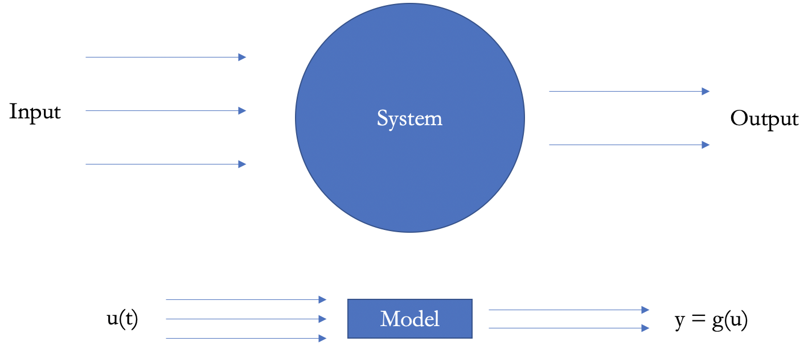

# Content

1. [Chapter 1: Introduction](#chapter1)
2. [Chapter 2: What a Model is?](#chapter2)
    - [Chapter 2 - Part 1: What a System is?](#chapter2part1)
    - [Chapter 2 - Part 2: What a Model is?](#chapter2part2)
    - [Chapter 2 - Part 3: The input-output model](#chapter2part3)
    - [Chapter 2 - Part 4: The concepts of state and state space](#chapter2part4)
    - [Chapter 2 - Part 5: System classifications](#chapter2part5)
3. [Chapter 3: Foundations](#chapter3)
    - [Chapter 3 - Part 1: Logic](#chapter3part1)
      - [Chapter 3 - Part 1.1: Argument](#chapter3part1.1)
      - [Chapter 3 - Part 1.2: Sentences](#chapter3part1.2)
      - [Chapter 3 - Part 1.3: Sentence Letters](#chapter3part1.3)
      - [Chapter 3 - Part 1.4: Connectives](#chapter3part1.4)
      - [Chapter 3 - Part 1.5: Quantified Logic](#chapter3part1.5)
      - [Chapter 3 - Part 1.6: Building blocks of QL](#chapter3part1.6)
      - [Chapter 3 - Part 1.7: Singular Terms](#chapter3part1.7)
      - [Chapter 3 - Part 1.8: Predicates](#chapter3part1.8)
      - [Chapter 3 - Part 1.9: Quantifiers](#chapter3part1.9)
      - [Chapter 3 - Part 1.10: Universe of Discourse](#chapter3part1.10)
      - [Chapter 3 - Part 1.11: Examples of Translating to QL](#chapter3part1.11)
      - [Chapter 3 - Part 1.12: Examples of Truth Table](#chapter3part1.12)
      - [Chapter 3 - Part 1.13: Symbols in QL](#chapter3part1.13)
      - [Chapter 3 - Part 1.14: Identity](#chapter3part1.14)
    - [Chapter 3 - Part 2: Sets](#chapter3part2)
      - [Chapter 3 - Part 2.1: Extensionality](#chapter3part2.1)
      - [Chapter 3 - Part 2.2: Subsets and Power Sets](#chapter3part2.2)
      - [Chapter 3 - Part 2.3: Some Important Sets](#chapter3part2.3)
      - [Chapter 3 - Part 2.4: Unions and Intersections](#chapter3part2.4)
      - [Chapter 3 - Part 2.5: Pairs, Tuples, Cartesian Products](#chapter3part2.5)
      - [Chapter 3 - Part 2.6: Russell’s Paradox](#chapter3part2.6)
    - [Chapter 3 - Part 3: Relations](#chapter3part3)
      - [Chapter 3 - Part 3.1: Relations as Sets](#chapter3part3.1)
      - [Chapter 3 - Part 3.2: Philosophical Reflections](#chapter3part3.2)
      - [Chapter 3 - Part 3.3: Special Properties of Relations](#chapter3part3.3)
      - [Chapter 3 - Part 3.4: Equivalence Relations](#chapter3part3.4)
      - [Chapter 3 - Part 3.5: Orders](#chapter3part3.5)
      - [Chapter 3 - Part 3.6: Graphs](#chapter3part3.6)
      - [Chapter 3 - Part 3.7: Operations on Relations](#chapter3part3.7)
    - [Chapter 3 - Part 4: Functions](#chapter3part4)
      - [Chapter 3 - Part 4.1: Basics](#chapter3part4.1)
      - [Chapter 3 - Part 4.2: Kinds of Functions](#chapter3part4.2)
      - [Chapter 3 - Part 4.3: Functions as Relations](#chapter3part4.3)
      - [Chapter 3 - Part 4.4: Inverses of Functions](#chapter3part4.4)
      - [Chapter 3 - Part 4.5: Composition of Functions](#chapter3part4.5)
      - [Chapter 3 - Part 4.6: Partial Functions](#chapter3part4.6)
4. [Chapter 4: Discrete Event Systems](#chapter4)
    - [Chapter 4 - Part 1: Discrete Event Systems](#chapter4part1)
    - [Chapter 4 - Part 2: The Concept of Event](#chapter4part2)
    - [Chapter 4 - Part 3: Characteristic Properties of Discrete Event Systems](#chapter4part3)
    - [Chapter 4 - Part 4: The Three Levels of Abstraction in the Study of Discrete Event Systems](#chapter4part4)
    - [Chapter 4 - Part 5: Examples of Discrete Event Systems](#chapter4part5)
    - [Chapter 4 - Part 6: Summary of System Classifications](#chapter4part6)
5. [Chapter 5: Languages and Automata](#chapter5)
    - [Chapter 5 - Part 1: Introduction](#chapter5part1)
    - [Chapter 5 - Part 2: The Concepts of Languages and Automata](#chapter5part2)
      - [Chapter 5 - Part 2.1: Language Models of Discrete Event Systems](#chapter5part2.1)
      - [Chapter 5 - Part 2.2: Automata](#chapter5part2.2)
      - [Chapter 5 - Part 2.3: Languages Represented by Automata](#chapter5part2.3)
      - [Chapter 5 - Part 2.4: Nondeterministic Automata](#chapter5part2.4)
      - [Chapter 5 - Part 2.5: Automata with Inputs and Outputs](#chapter5part2.5)
6. [Chapter 6: Installing Spin](#chapter6)
      - [Chapter 6 - Part 1: Installing Spin in Windows](#chapter6part1)
      - [Chapter 6 - Part 2: Installing Spin in Linux](#chapter6part2)
7. [Chapter 7: Sequential Programming in PROMELA](#chapter7)
    - [Chapter 7 - Part 1: Introduction](#chapter7part1)
    - [Chapter 7 - Part 2: A First Program in PROMELA](#chapter7part2)
    - [Chapter 7 - Part 3: Data Types](#chapter7part3)
    - [Chapter 7 - Part 4: Operators and Expressions](#chapter7part4)
    - [Chapter 7 - Part 5: Control Statements: Selection](#chapter7part5)
    - [Chapter 7 - Part 6: Control Statements: Repetitive](#chapter7part6)
    - [Chapter 7 - Part 7: Vectors and Enumerations](#chapter7part7)
    - [Chapter 7 - Part 8: Functions and Macros](#chapter7part8)
7. [Chapter 8: Verification Fundamentals of Models](#chapter8)
    - [Chapter 8 - Part 1: Assertions](#chapter8part1)
    - [Chapter 8 - Part 2: Non-Determinism](#chapter8part2)
8. [Bibliography's](#biblio)

## <a name="chapter1"></a>Chapter 1: Introduction

**Topics**

- What a model is
- Foundations
    - Logic
    - Proof techniques
    - Sequences
    - Sets
    - Relations
    - Functions
- Discrete event systems
    - Finite-state machines
    - Reasoning about state machines
- Introduction to model checking
    - Verification of sequential programs
- Introduction to concurrency
    - Concurrent state machines
    - Modeling techniques
    - Reasoning about concurrency
- Linear Temporal Logic
    - Automated reasoning and formal verification
- Modeling distributed systems
    - Reasoning about communicating processes
- First-order logic
    - Java Modeling Language
    - Static checking Java programs.

## <a name="chapter2"></a>Chapter 2: What a Model is?

#### <a name="chapter2part1"></a>Chapter 2 - Part 1: What a System is?

A system is a group of interacting or interrelated elements that act according to a set of rules to form a unified whole. A system, surrounded and influenced by its environment, is described by its boundaries, structure and purpose and expressed in its functioning. Systems are the subjects of study of systems theory.

**Environment and boundaries**

Systems theory views the world as a complex system of interconnected parts. One scopes a system by defining its **boundary**; this means choosing which entities are inside the system and which are outside (**environment**). One can make simplified representations (**models**) of the system in order to understand it and to predict or impact its future behavior. These models may define the structure and behavior of the system.

<br>

<div align="center"><br><sub>Fig 1 - Open systems have input and output flows, representing exchanges of matter, energy or information with their surroundings. - (<a href='https://commons.wikimedia.org/wiki/File:OpenSystemRepresentation.svg'>Work by Kraus  https://commons.wikimedia.org/wiki/User:Krauss </a>) </sub></div>

<br>

**So, what is a system?**

A system is a set of interacting or interdependent entities, real or abstract, forming an integrated whole. In general, a system is a construct or collection of different elements that together can produce results not obtainable by the elements alone.

#### <a name="chapter2part2"></a>Chapter 2 - Part 2: What a Model is?

Software engineering activities require clear, unambiguous and abstract models for reasoning about the properties of systems

- **Abstraction** allows focus on small but suffcient details of systems.
- **Unambiguous** descriptions improve communication and understanding.
- **Choices** and design decisions are exposed.
- **Analysis**, reasoning and automated verification become possible.

We use models when we think about problems, and when we talk to each other, and when we construct mechanisms, and when we try to understand phenomena, and when we teach. In short, we use models all the time.

Models have never been invented, they have been around (at least) since humans started to exist. Therefore, nobody can just define what a model is, and expect that other people will accept this definition; endless discussions have proven that there is no consistent common understanding of models.

The particular strength of models is based on the idea of abstraction: a model is usually not related to one particular object or phenomenon only, but to many, possibly to an unlimited number of them, it is related to a class.

Models help in developing artefacts by providing information about the consequences of building those artefacts before they are actually made. Such information may be highly formal (like the theory of mechanics, as it is applied in the construction of bridges, or the theory of computational complexity which is used in the analysis of algorithms) or rather informal (like a rough drawing of a machine, or a textual specification of a software system). Interface definitions are models too; they are particularly important for the spreading of technology.

Model of Software Engineer have relation ship with core of software engineering subjects

- Methods
    - Formally specifying requirements clarifies the problem space and the design constraints
- Architecture
    - Formal models of software architectures (behaviour of components and connectors)
    - Exposes design decisions and allows simulation
- Analysis
    - Is the system performing well (e.g., safety-critical systems)?
    - Will it behave as intended in all foreseen operating conditions?
    - This course provides the foundations to other subjects
- Management    
    - Processes can also be modelled
    - Analysis of process models provides performance indicators

**So, what is a model?**

One develops a **model** that reproduces the actual **system** to understand how the system works. If the **model** is accurate, it will be useful in answering some questions about the actual **system**.

#### <a name="chapter2part3"></a>Chapter 2 - Part 3: The input-output model

<br>

<div align="center"><br><sub>Fig 2 - The input-output model - (<a href='https://www.uc.pt/en/fctuc/dei'>Work by University of Coimbra - DEI - https://www.uc.pt/en/fctuc/dei </a>) </sub></div>

<br>

- Select the system's measurable variables (e.g., position, temperature, voltage)
- Select a subset of input variables that one can change over time
- Select another set of output variables that one can measure directly (e.g., responses to stimuli)
- Obtain the relationship between input and output (the model)

#### <a name="chapter2part4"></a>Chapter 2 - Part 4: The concepts of state and state space

The **state of a system** at instant t0 is the information needed, in addition to the input u(t), to uniquely predict all future output y(t).

- The input vector u(t) is insufficient for most systems.
- Input u(t), output y(t) and state x(t) are usually vectors.

<br>

<div align="center"><br><sub>Fig 3 - The concepts of state and state space - (<a href='https://www.uc.pt/en/fctuc/dei'>Work by University of Coimbra - DEI - https://www.uc.pt/en/fctuc/dei </a>) </sub></div>

<br>

A system's state space is the set of all distinct values that the state can take.

One constructs a state space model of a system by obtaining f (x(t), u(t), t) with x(t0) = x0 and g(x(t), u(t), t)

#### <a name="chapter2part5"></a>Chapter 2 - Part 4: System classifications

- **Static and dynamic systems** In a static system the output is independent of the past inputs; in a **dynamic** system the output depends on the past input values.
- **Time-varying and time-invariant systems** A **time-invariant** system does not modify its behaviour with time; the response to a particular input is always the same.
- **Linear and nonlinear Systems** Linear systems satisfy the condition that g(a1u1 + a2u2) = g(a1u1) + g(a2u2), that is, the output is a linear function of the input; discrete event systems are **nonlinear** due to state transitions caused by events.
- **Continuous-state and discrete-state systems** In a **discrete-state** system the state variables belong to a discrete set (e.g., the natural numbers); in a continuous-state system the variables can take real or complex values.

Informatic systems is dynamic, time-invariant, nonlinear and discrete-state

## <a name="chapter3"></a>Chapter 3: Foundations

#### <a name="chapter3part1"></a>Chapter 3 - Part 1: Logic

Logic is the business of **evaluating arguments**, sorting good ones from bad ones. In everyday language, we sometimes use the word **'argument'** to refer to belligerent
shouting matches. A logical argument is structured to give someone a reason to believe some conclusion.

Example: It is raining heavily and If you do not take an umbrella, you will get soaked. Therefore, You should take an umbrella

#### <a name="chapter3part1.1"></a>Chapter 3 - Part 1.1: Argument

When people mean to give arguments, they typically often use words like **'therefore'** and **'because'**. When analyzing an argument, the first thing to do is to separate the premises from the conclusion 

**premise indicators**: since, because, given that

**conclusion indicators**: therefore, hence, thus, then, so

To be perfectly general, we can define an argument as a series of sentences. The sentences at the beginning of the series are premises. The final sentence in the series is the conclusion.

If the premises are true and the argument is a good one, then you have a reason to accept the conclusion.

#### <a name="chapter3part1.2"></a>Chapter 3 - Part 1.2: Sentences

In logic, we are only interested in sentences that can figure as a premise or conclusion of an argument. So we will say that a sentence is something that can be true or false.

**Propositional logic deals with sentences that are either true (T) or false (F)**

#### <a name="chapter3part1.3"></a>Chapter 3 - Part 1.3: Sentence Letters

In SL, capital letters are used to represent basic sentences. 

Example: 

1. There is an apple on the desk.

2. If there is an apple on the desk, then Jenny made it to class.

3. Therefore, Jenny made it to class.

What happens if we replace each sentence with a letter?

**A**: There is an apple on the desk.

**B**: If there is an apple on the desk, then Jenny made it to class.

**C**: Jenny made it to class.

We would then symbolize the argument in this way:

**A**

**B**

Therefore **C**

#### <a name="chapter3part1.4"></a>Chapter 3 - Part 1.4: Connectives

<br>

<div align="center"><br><sub>Fig 4 - Logical Connectives- (<a href='https://forallx.openlogicproject.org/forallxyyc.pdf'>Work by P. D. Magnus</a>) </sub></div>

<br>

- Negation (¬)

<br>

<div align="center"><br><sub>Fig 5 - Negation- (<a href='https://forallx.openlogicproject.org/forallxyyc.pdf'>Work by P. D. Magnus</a>) </sub></div>

<br>

- Conjunction (& ^)

<br>

<div align="center"><br><sub>Fig 6 - Conjunction - (<a href='https://forallx.openlogicproject.org/forallxyyc.pdf'>Work by P. D. Magnus</a>) </sub></div>

<br>

- Disjunction (∨)

<br>

<div align="center"><br><sub>Fig 7 - Disjunction - (<a href='https://forallx.openlogicproject.org/forallxyyc.pdf'>Work by P. D. Magnus</a>) </sub></div>

<br>

- Conditional (→)

<br>

<div align="center"><br><sub>Fig 8 - Conditional - (<a href='https://forallx.openlogicproject.org/forallxyyc.pdf'>Work by P. D. Magnus</a>) </sub></div>

<br>

- Biconditional (↔)

<br>

<div align="center"><br><sub>Fig 9 - Biconditional - (<a href='https://forallx.openlogicproject.org/forallxyyc.pdf'>Work by P. D. Magnus</a>) </sub></div>

<br>

- Expressions

<br>

<div align="center"><br><sub>Fig 10 - Expressions - (<a href='https://forallx.openlogicproject.org/forallxyyc.pdf'>Work by P. D. Magnus</a>) </sub></div>

<br>

**Tautology**

In mathematical logic, a tautology (from Greek: ταυτολογία) is a formula or assertion that is true in every possible interpretation.

The problem of determining whether a formula is a tautology is fundamental in propositional logic. If there are n variables occurring in a formula then there are 2n distinct valuations for the formula. Therefore, the task of determining whether or not the formula is a tautology is a finite and mechanical one: one needs only to evaluate the truth value of the formula under each of its possible valuations. One algorithmic method for verifying that every valuation makes the formula to be true is to make a truth table that includes every possible valuation.

For example, consider the formula

((A ^ B) → C) ↔ (A → (B → C))

There are 8 possible valuations for the propositional variables A, B, C, represented by the first three columns of the following table. The remaining columns show the truth of subformulas of the formula above, culminating in a column showing the truth value of the original formula under each valuation.

<br>

<div align="center"><br><sub>Fig 11 - Verifying Tautologies - (<a href='https://forallx.openlogicproject.org/forallxyyc.pdf'>Work by P. D. Magnus</a>) </sub></div>

<br>

Because each row of the final column shows T, the sentence in question is verified to be a tautology.

#### <a name="chapter3part1.5"></a>Chapter 3 - Part 1.5: Quantified Logic

Consider the following argument, which is obviously valid in English:

If everyone knows logic, then either no one will be confused or everyone will. Everyone will be confused only if we try to believe a contradiction. This is a logic class, so everyone knows logic. Therefore, If we don't try to believe a contradiction, then no one will be confused.

In order to symbolize this in SL, we will need a symbolization key.

**L**: Everyone knows logic.

**N**: No one will be confused.

**E**: Everyone will be confused.

**B**: We try to believe a contradiction.

Notice that N and E are both about people being confused, but they are two separate sentence letters. We could not replace E with ¬N. Why not? ¬N means 'It is not the case that no one will be confused.' This would be the case if even one person were confused, so it is a long way from saying that everyone will be confused.

Once we have separate sentence letters for N and E, however, we erase any connection between the two. They are just two atomic sentences which might be true or false independently. In English, it could never be the case that both no one and everyone was confused. As sentences of SL, however, there is a truth-value assignment for which N and E are both true. 

Expressions like 'no one', 'everyone', and 'anyone' are called **quantifiers**. By translating N and E as separate atomic sentences, we leave out the quantifier structure of the sentences. Fortunately, the quantifier structure is not what makes this argument valid. As such, we can safely ignore it. To see this, we translate the argument to SL:

L → (N ∨ E)

E → B

L

Therefore ¬B→N

#### <a name="chapter3part1.6"></a>Chapter 3 - Part 1.6: Building blocks of QL

Just as sentences were the basic unit of sentential logic, predicates will be the basic unit of quantified logic. A predicate is an expression like 'is a dog'. This is not a sentence on its own. It is neither true nor false. In order to be true or false, we need to specify something: Who or what is it that is a dog?

The details of this will be explained in the rest of the chapter, but here is the basic idea: In QL, we will represent predicates with capital letters. For instance, we might let D stand for '___ is a dog.' We will use lower-case letters as the names of specific things. For instance, we might let **b** stand for Bertie. The expression **Db** will be a sentence in QL. It is a translation of the sentence **'Bertie is a dog.'**

In order to represent quantifier structure, we will also have symbols that represent quantifiers. For instance, '∃' will mean 'There is some____.' So to say that there is a dog, we can write ∃xDx; that is: There is some x such that x is a dog.

#### <a name="chapter3part1.7"></a>Chapter 3 - Part 1.7: Singular Terms

In English, a singular term is a word or phrase that refers to a specific person, place, or thing. The word 'dog' is not a singular term, because there are a great many dogs. The phrase 'Philip's dog Bertie' is a singular term, because it refers to a specific little terrier. We live with this kind of ambiguity in English, but it is important to keep in mind that singular terms in QL must refer to just one specific thing.

In QL, we will symbolize singular terms with lower-case letters a through w. We can add subscripts if we want to use some letter more than once. So a,b,c,...w, a1,f3,j390, and m12 are all terms in QL. Singular terms are called constants because they pick out specific individuals. Note that x; y, and z are not constants in QL. They will be variables, letters which do not stand for any specific thing.

#### <a name="chapter3part1.8"></a>Chapter 3 - Part 1.8: Predicates

The simplest predicates are properties of individuals. They are things you can say about an object. '_____ is a dog' and '_____ is a member of Monty Python' are both predicates.

In QL, we symbolize predicates with capital letters A through Z, with or without subscripts. When we give a symbolization key for predicates, we will not use blanks; instead, we will use variables. By convention, constants are listed at the end of the key.

**Ax**: x is angry. (A = '___ is angry')

**Hx**: x is happy. (H = '___ is Happy')

**T1xy**: x is as tall or taller than y. (T1 = '___ is tall')

**T2xy**: x is as tough or tougher than y. (T2 = '___ is tough')

**Bxyz**: y is between x and z. (B = '___ is between')

**d**: Donald.

**g**: Gregor

**m**: Marybeth

We can symbolize sentences that use any combination of these predicates and terms. For example:

1. Donald is angry.
2. If Donald is angry, then so are Gregor and Marybeth.
3. Marybeth is at least as tall and as tough as Gregor.
4. Donald is shorter than Gregor.
5. Gregor is between Donald and Marybeth.

Sentence 1 is straightforward: Ad. The 'x' in the key entry 'Ax' is just a placeholder; we can replace it with other terms when translating.
Sentence 2 can be paraphrased as, 'If Ad, then Ag and Am.' QL has all the truth-functional connectives of SL, so we translate this as Ad → (Ag & Am).
Sentence 3 can be translated as T1mg & T2mg.
Sentence 4 might seem as if it requires a new predicate. If we only needed to symbolize this sentence, we could define a predicate like Sxy to mean 'x is shorter than y.' However, this would ignore the logical connection between 'shorter' and 'taller.' Considered only as symbols of QL, there is no connection between S and T1. They might mean anything at all. Instead of introducing a new predicate, we paraphrase sentence 4 using predicates already in our key: 'It is not the case that Donald is as tall or taller than Gregor.' We can translate it as ¬T1dg.
Sentence 5 requires that we pay careful attention to the order of terms in the key. It becomes Bdgm.

#### <a name="chapter3part1.9"></a>Chapter 3 - Part 1.9: Quantifiers

We are now ready to introduce quantifiers. Consider these sentences:

6. Everyone is happy. (H = '___ is happy')
7. Everyone is at least as tough as Donald. (T2 = '___ is tough')
8. Someone is angry. (A = '___ is angry')

It might be tempting to translate sentence 6 as Hd & Hg & Hm. Yet this would only say that Donald, Gregor, and Marybeth are happy. **We want to say that everyone is happy, even if we have not defined a constant to name them**. In order to do this, we introduce the **'∀'** symbol. **This is called the universal quantifier**.

A quantifier must always be followed by a variable and a formula that includes that variable. We can translate sentence 6 as ∀xHx. **Paraphrased in English, this means 'For all x, x is happy.'** We call ∀x an x-quantifier. The formula that follows the quantifier is called the scope of the quantifier. We will give a formal definition of scope later, but intuitively it is the part of the sentence that the quantifier quantifies over. **In ∀xHx, the scope of the universal quantifier is Hx.**

Sentence 7 can be paraphrased as, 'For all x, x is at least as tough as Donald.' **This translates as ∀xT2xd.**

In these quantified sentences, the variable x is serving as a kind of placeholder. **The expression ∀x means that you can pick anyone and put them in as x.** There is no special reason to use x rather than some other variable. The sentence ∀xHx means exactly the same thing as ∀yHy, ∀zHz, and ∀x5Hx5.

To translate sentence 8, we introduce another new symbol: the existential quantifier, '∃' Like the universal quantifier, the existential quantifier requires a variable. Sentence 8 can be translated as ∃xAx. **This means that there is some x which is angry.** More precisely, it means that there is at least one angry person. Once again, the variable is a kind of placeholder; we could just as easily have translated sentence 8 as ∃zAz.

Consider these further sentences:

9. No one is angry. (A = '___ is angry')
10. There is someone who is not happy. (H = '___ is happy')
11. Not everyone is happy. (H = '___ is happy')

Sentence 9 can be paraphrased as, **'It is not the case that someone is angry.'** This can be translated using negation and an existential quantifier: ¬∃xAx. Yet sentence 9 could also be paraphrased as, . **'Everyone is not angry.'** With this in mind, it can be translated using negation and a universal quantifier: ∀x¬Ax. Both of these are acceptable translations, because they are logically equivalent. The critical thing is whether the negation comes before or after the quantifier.

Sentence 10 is most naturally paraphrased as, **'There is some x such that x is not happy.'** This becomes ∃xA¬Hx. Equivalently, we could write ¬∀xHx.

Sentence 11 is most naturally translated as ¬∀xHx This is logically equivalent to sentence 10 and so could also be translated as ∃x¬Hx.

#### <a name="chapter3part1.10"></a>Chapter 3 - Part 1.10: Universe of Discourse

Given the symbolization key we have been using, ∀xHx means 'Everyone is happy.' Who is included in this everyone? When we use sentences like this in English, we usually do not mean everyone now alive on the Earth. We certainly do not mean everyone who was ever alive or who will ever live. We mean something more modest: everyone in the building, everyone in the class, or everyone in the room.

In order to eliminate this ambiguity, we will need to specify a UNIVERSE OF DISCOURSE - abbreviated UD. The UD is the set of things that we are talking about. So if we want to talk about people in Chicago, we define the UD to be people in Chicago. We write this at the beginning of the symbolization key, like this:

UD: people in Chicago

The quantifiers range over the universe of discourse. Given this UD, ∀x means 'Everyone in Chicago' and ∃x means 'Someone in Chicago.' Each constant names some member of the UD, so we can only use this UD with the symbolization key above if Donald, Gregor, and Marybeth are all in Chicago. If we want to talk about people in places besides Chicago, then we need to include those people in the UD.

Even allowing for a UD with just one member can produce some strange results. Suppose we have this as a symbolization key:

UD: the Eiffiel Tower
Px: x is in Paris.

The sentence ∀xPx might be paraphrased in English as 'Everything is in Paris.' Yet that would be misleading. It means that everything in the UD is in Paris. **This UD contains only the Eifiel Tower, so with this symbolization key ∀xPx just means that the Eifiel Tower is in Paris.**

#### <a name="chapter3part1.11"></a>Chapter 3 - Part 1.11: Examples of Translating to QL

- **Translating to QL 1**

Consider these sentences:

14. Every coin in my pocket is a quarter. (Q = '___ is a quarter') (P = '___ in my pocket')
15. Some coin on the table is a dime. (D = '___ is a dime') (T = '___ is on the table.')
16. Not all the coins on the table are dimes.
17. None of the coins in my pocket are dimes.

UD: all coins
Px: x is in my pocket.
Tx: x is on the table.
Qx: x is a quarter.
Dx: x is a dime.

Sentence 14 is most naturally translated with a universal quantifier. The universal quantifier says something about everything in the UD, not just about the coins in my pocket. **Sentence 14 means that (for any coin) if that coin is in my pocket, then it is a quarter.** So we can translate it as ∀x(Px → Qx). Since sentence 14 is about coins that are both in my pocket and that are quarters, it might be tempting to translate it using a conjunction. However, the sentence ∀x(Px & Qx) would mean that everything in the UD is both in my pocket and a quarter: **All the coins that exist are quarters in my pocket.** This would be a crazy thing to say, and it means something very diferent than sentence 14.

Sentence 15 is most naturally translated with an existential quantifier. It says that there is some coin which is both on the table and which is a dime. So we can translate it as ∃x(Tx&Dx).Notice that we needed to use a conditional with the universal quantifier, but we used a conjunction with the existential quantifier. What would it mean to write ∃x(Tx→Dx) Probably not what you think. It means that there is some member of the UD which would satisfy the subformula; roughly speaking, there is some a such that (Ta → Da) is true. 

Sentence 16 can be paraphrased as, 'It is not the case that every coin on the table is a dime.' So we can translate it as ¬∀x(Tx → Dx). You might look at sentence 16 and paraphrase it instead as, 'Some coin on the table is not a dime.' You would then translate it as ∃x(Tx & ¬ Dx). Although it is probably not obvious, these two translations are logically equivalent.

Sentence 17 can be paraphrased as, 'It is not the case that there is some dime in my pocket' This can be translated as ¬∃x(Px & ¬ Dx). It might also be paraphrased as, 'Everything in my pocket is a non-dime', and then could be translated as ∀x(Px → ¬ Dx).

- **Translating to QL 2**

Willard is a logician. All logicians wear funny hats.
Therefore, Willard wears a funny hat.

UD: people
Lx: x is a logician.
Fx: x wears a funny hat.
w: Willard

Lw
∀x(Lx → Fx)
Fw

- **Translating to QL 3**

18. Every monkey knows sign language.
19. Some monkey knows sign language.

UD: animals
Mx: x is a monkey.
Sx: x knows sign language.

Sentence 18 can now be translated as ∀x(Mx → Sx).

Sentence 19 becomes ∃x(Mx & Sx).

- **Translating to QL 4**

20. Every rose has a thorn.

UD: everything
Rx: x is a rose.
Tx: x has a thorn

∀x(Rx → Tx).

If we change the UD to **only roses**

∀xTx

- **Translating to QL 5**

21. Esmerelda has a rose in her hair.
22. Everyone is cross with Esmerelda.

UD: people and plants
Px: x is a person.
Rx: x is a rose.
Tx: x has a thorn.
Cxy: x is cross with y.
Hxy: x has y in their hair.
e: Esmerelda

In sentence 21, since we do not have a predicate that means '...has a rose in her hair', translating sentence 21 will require paraphrasing. The sentence says that there is a rose in Esmerelda's hair that is, there is something which is both a rose and is in Esmerelda's hair. So we get: ∃x(Rx & Hex)

In sentence 22, we can paraphrase as, 'Every person is cross with Esmerelda.' This mean ∀x(Px → Cxe)

In general, the universal quantifier can be used to mean 'everyone' if the UD contains only people. If there are people and other things in the UD, then everyone' must be treated as 'every person.'

- **Translating to QL 6**

<br>

<div align="center"><br><sub>Fig 12 - Expressions - (<a href='https://forallx.openlogicproject.org/forallxyyc.pdf'>Work by P. D. Magnus</a>) </sub></div>

<br>

- **Translating to QL 7**

<br>

<div align="center"><br><sub>Fig 13 - Expressions - (<a href='https://forallx.openlogicproject.org/forallxyyc.pdf'>Work by P. D. Magnus</a>) </sub></div>

<br>

#### <a name="chapter3part1.12"></a>Chapter 3 - Part 1.12: Examples of Truth Table

<br>

<div align="center"><br><sub>Fig 14 - Truth Table (Tautology) - (<a href='https://forallx.openlogicproject.org/forallxyyc.pdf'>Work by P. D. Magnus</a>) </sub></div>

<br>

#### <a name="chapter3part1.13"></a>Chapter 3 - Part 1.13: Symbols in QL

<br>

<div align="center"><br><sub>Fig 15 - Symbols in QL - (<a href='https://forallx.openlogicproject.org/forallxyyc.pdf'>Work by P. D. Magnus</a>) </sub></div>

<br>

#### <a name="chapter3part1.14"></a>Chapter 3 - Part 1.14: Identity

Consider this sentence:

35. Pavel owes money to everyone else.

Let the UD be people; this will allow us to translate 'everyone' as a universal quantifier. Let Oxy mean 'x owes money to y', and let p mean Pavel. Now we can symbolize sentence 35 as ∀xOpx. Unfortunately, this translation has some odd consequences. It says that Pavel owes money to every member of the UD, including Pavel; it entails that Pavel owes money to himself. However, sentence 35 does not say that Pavel owes money to himself; he owes money to everyone else. This is a problem, because ∀xOpx is the best translation we can give of this sentence into QL.

The solution is to add another symbol to QL. The symbol '=' is a two-place predicate.

The predicate x = y means 'x is identical to y.' This does not mean merely that x and y are indistinguishable or that all of the same predicates are true of them. Rather, it means that x and y are the very same thing.

When we write x ≠ y, we mean that x and y are not identical. There is no reason to introduce this as an additional predicate. Instead, x ≠ y is an abbreviation of ¬(x = y).

Now suppose we want to symbolize this sentence:

36. Pavel is Mister Checkov.

Let the constant c mean Mister Checkov. Sentence 36 can be symbolized as p = c. This means that the constants p and c both refer to the same guy.

This is all well and good, but how does it help with sentence 35? That sentence can be paraphrased as, 'Everyone who is not Pavel is owed money by Pavel.' This is a sentence structure we already know how to symbolize: 'For all x, if x is not Pavel, then x is owed money by Pavel.' In QL with identity, this becomes ∀x(x ≠ p → Opx).

#### <a name="chapter3part2"></a>Chapter 3 - Part 2: Sets

A set is a collection of objects, considered as a single object. The objects making up the set are called elements or members of the set. If x is an element of a set a, we write x ∈ a; if not, we write x ∉ a. The set which has no elements is called the empty set and denoted “∅”.

A set is a collection of things.

For example, the items you wear is a set: these include hat, shirt, jacket, pants, and so on.

You write sets inside curly brackets like this:

- {hat, shirt, jacket, pants, ...}

You can also have sets of numbers:

- Set of whole numbers: {0, 1, 2, 3, ...}
- 
- Set of prime numbers: {2, 3, 5, 7, 11, 13, 17, ...}

[Source][sets-url]

#### <a name="chapter3part2.1"></a>Chapter 3 - Part 2.1: Extensionality

If A and B are sets, then A = B iff every element of A is also an element of B, and vice versa. Extensionality licenses some notation. In general, when we have some objects a1, . . . , an, then { a1, . . . , an} is the set whose elements are a1, . . . , an. We emphasise the word “the”, since extensionality tells us that there can be only one such set. Indeed, extensionality also licenses the following:

{ a, a, b } = { a, b } = { b, a }.

Whenever you have a bunch of objects, you can collect them together in a set. The set of Richard’s siblings, for instance, is a set that contains one person, and we could write it as S = { Ruth }. The set of positive integers less than 4 is { 1, 2, 3 }, but it can also be written as { 3, 2, 1 } or even as { 1, 2, 1, 2, 3 }. These are all the same set, by extensionality. For every element of { 1, 2, 3 } is also an element of { 3, 2, 1 } (and of { 1, 2, 1, 2, 3 }), and vice versa.

**Numerical Sets**

- Set of even numbers: {..., −4, −2, 0, 2, 4, ...}
- Set of odd numbers: {..., −3, −1, 1, 3, ...}
- Set of prime numbers: {2, 3, 5, 7, 11, 13, 17, ...}
- Positive multiples of 3 that are less than 10: {3, 6, 9}

We can also define a set by its properties, such as {x|x>0} which means "the set of all x's, such that x is greater than 0", see Set-Builder Notation to learn more.

Set A is {1,2,3}. We can see that 1 ∈ A, but 5 ∉ A

**Equality**

Two sets are equal if they have precisely the same members. Now, at first glance they may not seem equal, so we may have to examine them closely!

Example: Are A and B equal where:

- A is the set whose members are the first four positive whole numbers

- B = {4, 2, 1, 3}

Let's check. They both contain 1. They both contain 2. And 3, And 4. And we have checked every element of both sets, so: Yes, they are equal!

And the equals sign (=) is used to show equality, so we write:

A = B

[Source][sets-url]

#### <a name="chapter3part2.2"></a>Chapter 3 - Part 2.2: Subsets and Power Sets 

**Subset**

If every element of a set A is also an element of B, then we say that A is a subset of B, and write A ⊆ B. If A is not a subset of B we write A ⊈ B. If A ⊆ B but A ≠ B, we write A ⊂ B and say that A is a proper subset of B.

When we define a set, if we take pieces of that set, we can form what is called a subset.

Example: the set {1, 2, 3, 4, 5}

A subset of this is {1, 2, 3}. Another subset is {3, 4} or even another is {1}, etc.

But {1, 6} is not a subset, since it has an element (6) which is not in the parent set.

In general: A is a subset of B if and only if every element of A is in B.

So let's use this definition in some examples.

Example: Is A a subset of B, where A = {1, 3, 4} and B = {1, 4, 3, 2}?

1 is in A, and 1 is in B as well. So far so good.

3 is in A and 3 is also in B.

4 is in A, and 4 is in B.

That's all the elements of A, and every single one is in B, so we're done.

Yes, A is a subset of B

Note that 2 is in B, but 2 is not in A. But remember, that doesn't matter, we only look at the elements in A.

<br>

<div align="center"><br><sub>Fig 16 - Sub Set. - (<a href='https://www.mathsisfun.com/sets/sets-introduction.html'>Work by MathsIsFun.com </a>) </sub></div>

<br>

[Source][subset-url]

**Power Sets**

A Power Set is a set of all the subsets of a set.

Example:

For the set {a,b,c}:

- The empty set {} is a subset of {a,b,c}
- And these are subsets: {a}, {b} and {c}
- And these are also subsets: {a,b}, {a,c} and {b,c}
- And {a,b,c} is a subset of {a,b,c}

And altogether we get the Power Set of {a,b,c}:

P(S) = { {}, {a}, {b}, {c}, {a, b}, {a, c}, {b, c}, {a, b, c} }

Think of it as all the different ways we can select the items (the order of the items doesn't matter), including selecting none, or all.

<br>

<div align="center"><br><sub>Fig 17 - Power Set. - (<a href='https://www.mathsisfun.com/sets/sets-introduction.html'>Work by MathsIsFun.com </a>) </sub></div>

<br>

[Source][powerset-url]

#### <a name="chapter3part2.3"></a>Chapter 3 - Part 2.3: Some Important Sets

**Natural Numbers:** Common counting numbers.

N=1,2,3,4,...

**Prime Number:** A natural number greater than 1 which has only 1 and itself as factors.

P=2,3,5,7,11,13,17,…

**Composite Number:** A natural number greater than 1 which has more factors than 1 and itself.

4,6,8,9,10,12,...

**Whole Numbers:** The set of Natural Numbers with the number 0 adjoined.

W=0,1,2,3,4,…

**Integers:** Whole Numbers with their opposites (negative numbers) adjoined.

Z=…,−3,−2,−1,0,1,2,3,…

**Rational Numbers:** All numbers which can be written as fractions.

Q=−1/2, 0.33333…, 5/2, 11/10,…

**Irrational Numbers:** All numbers which cannot be written as fractions.

F=...,π, –√2, 0.121221222...

**Real Numbers:** The set of Rational Numbers with the set of Irrational Numbers adjoined.

R=...,−3, −1, 0, 1/5, 1.1, –√2, 2, 3, π,…

**Complex Number:** A number which can be written in the form a + bi where a and b are real numbers and i is the square root of -1.

C=..., −3+2i, 0, 1+3i,…

[Source][importantsets-url]

#### <a name="chapter3part2.4"></a>Chapter 3 - Part 2.4: Unions and Intersections

You could have a set made up of your ten best friends:

{alex, blair, casey, drew, erin, francis, glen, hunter, ira, jade}

Each friend is an "element" (or "member") of the set. It is normal to use lowercase letters for them.

Now let's say that alex, casey, drew and hunter play Soccer:

Soccer = {alex, casey, drew, hunter}

(It says the Set "Soccer" is made up of the elements alex, casey, drew and hunter.)

And casey, drew and jade play Tennis:

Tennis = {casey, drew, jade}

We can put their names in two separate circles:

<br>

<div align="center"><br><sub>Fig 18 - Two Sets. - (<a href='https://www.mathsisfun.com/sets/sets-introduction.html'>Work by MathsIsFun.com </a>) </sub></div>

<br>

[Source][union-url]

**Union**

The union of two sets A and B, written A ∪ B, is the set of all things which are elements of A, B, or both.

Since the multiplicity of elements doesn’t matter, the union of two sets which have an element in common contains that element only once, e.g., { a, b, c } ∪ { a, 0, 1 } = { a, b, c, 0, 1 }.

The union of a set and one of its subsets is just the bigger set: { a, b, c } ∪ { a } =  { a, b, c }.

The union of a set with the empty set is identical to the set: { a, b, c } ∪ ∅ = { a, b, c }.

You can now list your friends that play Soccer OR Tennis.

Soccer ∪ Tennis = {alex, casey, drew, hunter, jade}

Not everyone is in that set ... only your friends that play Soccer or Tennis (or both).

In other words we combine the elements of the two sets.

We can show that in a "Venn Diagram":

<br>

<div align="center"><br><sub>Fig 19 - Union Sets. - (<a href='https://www.mathsisfun.com/sets/sets-introduction.html'>Work by MathsIsFun.com </a>) </sub></div>

<br>

A Venn Diagram is clever because it shows lots of information:

Do you see that alex, casey, drew and hunter are in the "Soccer" set?
And that casey, drew and jade are in the "Tennis" set?
And here is the clever thing: casey and drew are in BOTH sets!
All that in one small diagram.

[Source][union-url]

**Intersection**

The intersection of two sets A and B, written A ∩ B, is the set of all things which are elements of both A and B.

If two sets have no elements in common, their intersection is empty:  {a, b, c } ∩  { 0, 1 } = ∅.

If two sets do have elements in common, their intersection is the set of all those:  { a, b, c } ∩  { a, b, d } = { a, b }.

The intersection of a set with one of its subsets is just the smaller set: { a, b, c } ∩  { a, b } = { a, b }.

The intersection of any set with the empty set is empty: { a, b, c} ∩ ∅ = ∅.

"Intersection" is when you must be in BOTH sets.

In our case that means they play both Soccer AND Tennis ... which is casey and drew.

The special symbol for Intersection is an upside down "U" like this: ∩

And this is how we write it:

Soccer ∩ Tennis = {casey, drew}

In a Venn Diagram:

<br>

<div align="center"><br><sub>Fig 20 - Intersection Sets. - (<a href='https://www.mathsisfun.com/sets/sets-introduction.html'>Work by MathsIsFun.com </a>) </sub></div>

<br>

[Source][union-url]

**Difference**

The set difference A \ B is the set of all elements of A which are not also elements of B, i.e.

You can also "subtract" one set from another.

For example, taking Soccer and subtracting Tennis means people that play Soccer but NOT Tennis ... which is alex and hunter.

And this is how we write it:

Soccer − Tennis = {alex, hunter}

In a Venn Diagram:

<br>

<div align="center"><br><sub>Fig 21 - Difference Sets. - (<a href='https://www.mathsisfun.com/sets/sets-introduction.html'>Work by MathsIsFun.com </a>) </sub></div>

<br>

[Source][union-url]

#### <a name="chapter3part2.5"></a>Chapter 3 - Part 2.5: Pairs, Tuples, Cartesian Products

It follows from extensionality that sets have no order to their elements. So if we want to represent order, we use ordered pairs  ⟨x,y⟩ . In an unordered pair  {x,y} , the order does not matter:  {x,y}={y,x} . In an ordered pair, it does: if  x≠y , then  ⟨x,y⟩≠⟨y,x⟩ .

How should we think about ordered pairs in set theory? Crucially, we want to preserve the idea that ordered pairs are identical iff they share the same first element and share the same second element, i.e.:

⟨a,b⟩=⟨c,d⟩ iff both a=c and b=d.

**Ordered pair**

We can define ordered pairs in set theory using the Wiener-Kuratowski definition.

⟨a,b⟩={{a},{a,b}} .

Using Definition  1.5.1 , prove that  ⟨a,b⟩=⟨c,d⟩  iff both  a=c  and  b=d .

Having fixed a definition of an ordered pair, we can use it to define further sets. For example, sometimes we also want ordered sequences of more than two objects, e.g., triples ⟨x,y,z⟩, quadruples ⟨x,y,z,u⟩, and so on. We can think of triples as special ordered pairs, where the first element is itself an ordered pair: ⟨x,y,z⟩ is ⟨⟨x,y⟩,z⟩. The same is true for quadruples: ⟨x,y,z,u⟩ is ⟨⟨⟨x,y⟩,z⟩,u⟩, and so on. In general, we talk of ordered n-tuples ⟨x1,…,xn⟩.

Certain sets of ordered pairs, or other ordered n-tuples, will be useful.

In the set theory, we learnt to write a set in different forms, we also learnt about different types of sets and studied operations on sets and Venn diagrams. Also in co-ordinate system we learnt about an ordered pair.

We studied ordered pair in co-ordinate system to locate a point. By the ordered pair (2, 5) we mean a pair of two integers, strictly in the order with 2 at first place called the abscissa and 5 at second place called the ordinate. 

The ordered pair (2, 5) is not equal to ordered pair (3, 2) i.e., (2, 5) ≠ (5, 2). Thus, in a pair, the order of elements is important. An ordered pair consists of two elements that are written in the fixed order. So, we define an ordered pair as: 

• The pair of elements that occur in particular order and are enclosed in brackets are called a set of ordered pairs. 

• If ‘a’ and ‘b’ are two elements, then the two different pairs are (a, b); (b, a) and (a, b); (b, a). 

• In an ordered pair (a, b), a is called the first component and b is called the second component. 

[Source][ordered-pair-url]

**Cartesian Product**

Given sets  A  and  B , their Cartesian product  A×B  is defined by

A×B={⟨x,y⟩:x∈A and y∈B}.

If  A={0,1} , and  B={1,a,b} , then their product is

A×B={⟨0,1⟩,⟨0,a⟩,⟨0,b⟩,⟨1,1⟩,⟨1,a⟩,⟨1,b⟩}.

If  A  has  n  elements and  B  has  m  elements, then  A×B  has  n⋅m  elements.

Proof. For every element  x  in  A , there are  m  elements of the form  ⟨x,y⟩∈A×B . Let  Bx={⟨x,y⟩:y∈B} . Since whenever  x1≠x2 ,  ⟨x1,y⟩≠⟨x2,y⟩ ,  Bx1∩Bx2=∅ . But if  A={x1,…,xn} , then  A×B=Bx1∪⋯∪Bxn , and so has  n⋅m  elements.

To visualize this, arrange the elements of  A×B  in a grid:

Bx1={⟨x1,y1⟩ ⟨x1,y2⟩…⟨x1,ym⟩}
Bx2={⟨x2,y1⟩ ⟨x2,y2⟩…⟨x2,ym⟩}
⋮              ⋮
Bxn={⟨xn,y1⟩xn,y2⟩…⟨xn,ym⟩}

Since the  xi  are all different, and the  yj  are all different, no two of the pairs in this grid are the same, and there are  n⋅m  of them.

If A and B are two non-empty sets, then their Cartesian product A × B is the set of all ordered pair of elements from A and B.

        A × B = {(x, y) : x ∈ A, y ∈ B}

Suppose, if A and B are two non-empty sets, then the Cartesian product of two sets, A and set B is the set of all ordered pairs (a, b) such that a ∈A and b∈B which is denoted as A × B.

For Example; 

1. If A = {7, 8} and B = {2, 4, 6}, find A × B. 

Solution:

A × B = {(7, 2); (7, 4); (7, 6); (8, 2); (8, 4); (8, 6)} 

The 6 ordered pairs thus formed can represent the position of points in a plane, if a and B are subsets of a set of real numbers. 

2. If A × B = {(p, x); (p, y); (q, x); (q, y)}, find A and B. 

Solution:

A is a set of all first entries in ordered pairs in A × B.

B is a set of all second entries in ordered pairs in A × B.

Thus A = {p, q} and B = {x, y}


3. If A and B are two sets, and A × B consists of 6 elements: If three elements of A × B are (2, 5) (3, 7) (4, 7) find A × B.

Solution:

Since, (2, 5) (3, 7) and (4, 7) are elements of A × B.

So, we can say that 2, 3, 4 are the elements of A and 5, 7 are the elements of B.

So, A = {2, 3, 4} and B = {5, 7}

Now, A × B = {(2, 5); (2, 7); (3, 5); (3, 7); (4, 5); (4, 7)}

Thus, A × B contain six ordered pairs.


4. If A = { 1, 3, 5} and B = {2, 3}, then
Find: (i) A × B (ii) B × A (iii) A × A (iv) (B × B)

Solution:

A ×B={1, 3, 5} × {2,3} = [{1, 2},{1, 3},{3, 2},{3, 3},{5, 2},{5, 3}]

B × A = {2, 3} × {1, 3, 5} = [{2, 1},{2, 3},{2, 5},{3, 1},{3, 3},{3, 5}]

A × A = {1, 3, 5} × {1, 3, 5}= [{1, 1},{1, 3},{1, 5},{3, 1},{3, 3},{3, 5},{5, 1},{5, 3},{5, 5}]

B × B = {2, 3} × {2, 3} = [{2, 2},{2, 3},{3, 2},{3, 3}]

Note:

If either A or B are null sets, then A ×B will also be an empty set, i.e., if A = ∅ or

B = ∅, then A × B = ∅

[Source][cartesianproduct-url]

#### <a name="chapter3part2.6"></a>Chapter 3 - Part 2.6: Russell’s Paradox

Extensionality licenses the notation  {x:ϕ(x)} , for the set of  x ’s such that  ϕ(x) . However, all that extensionality really licenses is the following thought. If there is a set whose members are all and only the  ϕ ’s, then there is only one such set. Otherwise put: having fixed some  ϕ , the set  {x:ϕ(x)}  is unique, if it exists.

But this conditional is important! Crucially, not every property lends itself to comprehension. That is, some properties do not define sets. If they all did, then we would run into outright contradictions. The most famous example of this is Russell’s Paradox.

Sets may be elements of other sets—for instance, the power set of a set  A  is made up of sets. And so it makes sense to ask or investigate whether a set is an element of another set. Can a set be a member of itself? Nothing about the idea of a set seems to rule this out. For instance, if all sets form a collection of objects, one might think that they can be collected into a single set—the set of all sets. And it, being a set, would be an element of the set of all sets.

Russell’s Paradox arises when we consider the property of not having itself as an element, of being non-self-membered. What if we suppose that there is a set of all sets that do not have themselves as an element? Does
R={x:x∉x}

exist? It turns out that we can prove that it does not.

There is no set  R={x:x∉x} .

Proof. For reductio, suppose that  R={x:x∉x}  exists. Then  R∈R  iff  R∉R , since sets are extensional. But this is a contradicion.

Let’s run through the proof that no set R of non-self-membered sets can exist more slowly. If R exists, it makes sense to ask if R∈R or not—it must be either ∈R or ∉R. Suppose the former is true, i.e., R∈R. R was defined as the set of all sets that are not elements of themselves, and so if R∈R, then R does not have this defining property of R. But only sets that have this property are in R, hence, R cannot be an element of R, i.e., R∉R. But R can’t both be and not be an element of R, so we have a contradiction.

Since the assumption that R∈R leads to a contradiction, we have R∉R. But this also leads to a contradiction! For if R∉R, it does have the defining property of R, and so would be an element of R just like all the other non-self-membered sets. And again, it can’t both not be and be an element of R.

How do we set up a set theory which avoids falling into Russell’s Paradox, i.e., which avoids making the inconsistent claim that R={x:x∉x} exists? Well, we would need to lay down axioms which give us very precise conditions for stating when sets exist (and when they don’t).

The set theory sketched in this chapter doesn’t do this. It’s genuinely naïve. It tells you only that sets obey extensionality and that, if you have some sets, you can form their union, intersection, etc. It is possible to develop set theory more rigorously than this.

#### <a name="chapter3part3"></a>Chapter 3 - Part 3: Relations

#### <a name="chapter3part3.1"></a>Chapter 3 - Part 3.1: Relations as Sets

We mentioned some important sets:  N ,  Z ,  Q ,  R .

Recall the notion of a ordered pair: given  a  and  b , we can form  ⟨a,b⟩ . Importantly, the order of elements does matter here. So if  a≠b  then  ⟨a,b⟩≠⟨b,a⟩ . (Contrast this with unordered pairs, i.e.,  2 -element sets, where  {a,b}={b,a} .) 

Second, recall the notion of a Cartesian product: if  A  and  B  are sets, then we can form  A×B , the set of all pairs  ⟨x,y⟩  with  x∈A  and  y∈B . In particular,  A<sup>2</sup>=A×A  is the set of all ordered pairs from  A .

Now we will consider a particular relation on a set: the  < -relation on the set  N  of natural numbers. Consider the set of all pairs of numbers  ⟨n,m⟩  where  n<m , i.e.,

R={⟨n,m⟩:n,m∈N and n<m}

There is a close connection between n being less than m, and the pair ⟨n,m⟩ being a member of R, namely:

n<m iff ⟨n,m⟩∈R.

Indeed, without any loss of information, we can consider the set R to be the <-relation on N.

In the same way we can construct a subset of N<sup>2</sup> for any relation between numbers. Conversely, given any set of pairs of numbers S⊆N<sup>2</sup>, there is a corresponding relation between numbers, namely, the relationship n bears to m if and only if ⟨n,m⟩∈S. This justifies the following definition:

**Binary Relation**

A binary relation on a set  A  is a subset of  A<sup>2</sup> . If  R⊆A<sup>2</sup>  is a binary relation on  A  and  x,y∈A , we sometimes write  Rxy  (or  xRy ) for  ⟨x,y⟩∈R .

The set  N<sup>2</sup>  of pairs of natural numbers can be listed in a 2-dimensional matrix like this:

**⟨0,0⟩**⟨0,1⟩⟨0,2⟩⟨0,3⟩
⟨1,0⟩**⟨1,1⟩**⟨1,2⟩⟨1,3⟩
⟨2,0⟩⟨2,1⟩**⟨2,2⟩**⟨2,3⟩
⟨3,0⟩⟨3,1⟩⟨3,2⟩**⟨3,3⟩**
  ⋮    ⋮    ⋮      ⋮

We have put the diagonal, here, in bold, since the subset of  N<sup>2</sup>  consisting of the pairs lying on the diagonal, i.e.,

{⟨0,0⟩,⟨1,1⟩,⟨2,2⟩,…},

is the identity relation on  N . (Since the identity relation is popular, let’s define  IdA={⟨x,x⟩:x∈X}  for any set  A .) The subset of all pairs lying above the diagonal, i.e.,

L={⟨0,1⟩,⟨0,2⟩,…,⟨1,2⟩,⟨1,3⟩,…,⟨2,3⟩,⟨2,4⟩,…},

is the less than relation, i.e.,  Lnm  iff  n<m . The subset of pairs below the diagonal, i.e.,

G={⟨1,0⟩,⟨2,0⟩,⟨2,1⟩,⟨3,0⟩,⟨3,1⟩,⟨3,2⟩,…},

is the greater than relation, i.e.,  Gnm  iff  n>m . The union of  L  with  I , which we might call  K=L∪I , is the less than or equal to relation:  Knm  iff  n≤m . Similarly,  H=G∪I  is the greater than or equal to relation. These relations  L ,  G ,  K , and  H  are special kinds of relations called orders.  L  and  G  have the property that no number bears  L  or  G  to itself (i.e., for all  n , neither  Lnn  nor  Gnn ). Relations with this property are called irreflexive, and, if they also happen to be orders, they are called strict orders.

#### <a name="chapter3part3.2"></a>Chapter 3 - Part 3.2: Philosophical Reflections

we defined relations as certain sets. We should pause and ask a quick philosophical question: what is such a definition doing? It is extremely doubtful that we should want to say that we have discovered some metaphysical identity facts; that, for example, the order relation on  N  turned out to be the set  R={⟨n,m⟩:n,m∈N and n<m}  we defined in section 2.1. Here are three reasons why.

First: in Definition 1.5.1, we defined  ⟨a,b⟩={{a},{a,b}} . Consider instead the definition  ∥a,b∥={{b},{a,b}}=⟨b,a⟩ . When  a≠b , we have that  ⟨a,b⟩≠∥a,b∥ . But we could equally have regarded  ∥a,b∥  as our definition of an ordered pair, rather than  ⟨a,b⟩ . Both definitions would have worked equally well. So now we have two equally good candidates to “be” the order relation on the natural numbers, namely:
RS={⟨n,m⟩:n,m∈N and n<m}={∥n,m∥:n,m∈N and n<m}.

Since  R≠S , by extensionality, it is clear that they cannot both be identical to the order relation on  N . But it would just be arbitrary, and hence a bit embarrassing, to claim that  R  rather than  S  (or vice versa) is the ordering relation, as a matter of fact. (This is a very simple instance of an argument against set-theoretic reductionism which Benacerraf made famous in 1965. We will revisit it several times.)

Second: if we think that every relation should be identified with a set, then the relation of set-membership itself,  ∈ , should be a particular set. Indeed, it would have to be the set  {⟨x,y⟩:x∈y} . But does this set exist? Given Russell’s Paradox, it is a non-trivial claim that such a set exists. In fact, it is possible to develop set theory in a rigorous way as an axiomatic theory. In this theory, it will be provable that there is no set of all sets. So, even if some relations can be treated as sets, the relation of set-membership will have to be a special case.

Third: when we “identify” relations with sets, we said that we would allow ourselves to write  Rxy  for  ⟨x,y⟩∈R . This is fine, provided that the membership relation, “ ∈ ”, is treated as a predicate. But if we think that “ ∈ ” stands for a certain kind of set, then the expression “ ⟨x,y⟩∈R ” just consists of three singular terms which stand for sets: “ ⟨x,y⟩ ”, “ ∈ ”, and “ R ”. And such a list of names is no more capable of expressing a proposition than the nonsense string: “the cup penholder the table”. Again, even if some relations can be treated as sets, the relation of set-membership must be a special case. (This rolls together a simple version of Frege’s concept horse paradox, and a famous objection that Wittgenstein once raised against Russell.)

So where does this leave us? Well, there is nothing wrong with our saying that the relations on the numbers are sets. We just have to understand the spirit in which that remark is made. We are not stating a metaphysical identity fact. We are simply noting that, in certain contexts, we can (and will) treat (certain) relations as certain sets.

#### <a name="chapter3part3.3"></a>Chapter 3 - Part 3.3: Special Properties of Relations

Some kinds of relations turn out to be so common that they have been given special names. For instance, ≤ and ⊆ both relate their respective domains (say, N in the case of ≤ and ℘(A) in the case of ⊆) in similar ways. To get at exactly how these relations are similar, and how they differ, we categorize them according to some special properties that relations can have. It turns out that (combinations of) some of these special properties are especially important: orders and equivalence relations.

**Reflexivity**

A relation  R⊆A<sup>2</sup>  is reflexive iff, for every  x∈A ,  Rxx .

**Transitivity**

A relation  R⊆A<sup>2</sup>  is transitive iff, whenever  Rxy  and  Ryz , then also  Rxz .

**Symmetry**

A relation  R⊆A<sup>2</sup>  is symmetric iff, whenever  Rxy , then also  Ryx .

**Anti-symmetry**

A relation  R⊆A<sup>2</sup>  is anti-symmetric iff, whenever both  Rxy  and  Ryx , then  x=y  (or, in other words: if  x≠y  then either  ¬Rxy  or  ¬Ryx ).

In a symmetric relation,  Rxy  and  Ryx  always hold together, or neither holds. In an anti-symmetric relation, the only way for  Rxy  and  Ryx  to hold together is if  x=y . Note that this does not require that  Rxy  and  Ryx  holds when  x=y , only that it isn’t ruled out. So an anti-symmetric relation can be reflexive, but it is not the case that every anti-symmetric relation is reflexive. Also note that being anti-symmetric and merely not being symmetric are different conditions. In fact, a relation can be both symmetric and anti-symmetric at the same time (e.g., the identity relation is).

**Connectivity**

A relation  R⊆A<sup>2</sup>  is connected if for all  x,y∈A , if  x≠y , then either  Rxy  or  Ryx .

**Irreflexivity**

A relation  R⊆A<sup>2</sup>  is called irreflexive if, for all  x∈A , not  Rxx .

**Asymmetry**

A relation  R⊆A<sup>2</sup>  is called asymmetric if for no pair  x,y∈A  we have both  Rxy  and  Ryx .

Note that if  A≠∅ , then no irreflexive relation on  A  is reflexive and every asymmetric relation on  A  is also anti-symmetric. However, there are  R⊆A<sup>2</sup>  that are not reflexive and also not irreflexive, and there are anti-symmetric relations that are not asymmetric.

#### <a name="chapter3part3.4"></a>Chapter 3 - Part 3.4: Equivalence Relations

The identity relation on a set is reflexive, symmetric, and transitive. Relations R that have all three of these properties are very common.

**Equivalence Relation**

A relation  R⊆A<sup>2</sup>  that is reflexive, symmetric, and transitive is called an equivalence relation. Elements  x  and  y  of  A  are said to be  R -equivalent if  Rx.

Equivalence relations give rise to the notion of an equivalence class. An equivalence relation “chunks up” the domain into different partitions. Within each partition, all the objects are related to one another; and no objects from different partitions relate to one another. Sometimes, it’s helpful just to talk about these partitions directly. To that end, we introduce a definition:

Let  R⊆A<sup>2</sup>  be an equivalence relation. For each  x∈A , the equivalence class of  x  in  A  is the set  [x]R={y∈A:Rxy} . The quotient of  A  under  R  is  A/R={[x]R:x∈A} , i.e., the set of these equivalence classes.

If  R⊆A2  is an equivalence relation, then  Rxy  iff  [x]R=[y]R .

Proof. For the left-to-right direction, suppose  Rxy , and let  z∈[x]R . By definition, then,  Rxz . Since  R  is an equivalence relation,  Ryz . (Spelling this out: as  Rxy  and  R  is symmetric we have  Ryx , and as  Rxz  and  R  is transitive we have  Ryz .) So  z∈[y]R . Generalising,  [x]R⊆[y]R . But exactly similarly,  [y]R⊆[x]R . So  [x]R=[y]R , by extensionality.

For the right-to-left direction, suppose  [x]R=[y]R . Since  R  is reflexive,  Ryy , so  y∈[y]R . Thus also  y∈[x]R  by the assumption that  [x]R=[y]R . So  Rxy .

A nice example of equivalence relations comes from modular arithmetic. For any  a ,  b , and  n∈N , say that  a≡nb  iff dividing  a  by  n  gives remainder  b . (Somewhat more symbolically:  a≡nb  iff  (∃k∈N)a−b=kn .) Now,  ≡n  is an equivalence relation, for any  n . And there are exactly  n  distinct equivalence classes generated by  ≡n ; that is,  N/≡n  has  n  elements. These are: the set of numbers divisible by  n  without remainder, i.e.,  [0]≡n ; the set of numbers divisible by  n  with remainder  1 , i.e.,  [1]≡n ; …; and the set of numbers divisible by  n  with remainder  n−1 , i.e.,  [n−1]≡n .

#### <a name="chapter3part3.5"></a>Chapter 3 - Part 3.5: Orders

Many of our comparisons involve describing some objects as being “less than”, “equal to”, or “greater than” other objects, in a certain respect. These involve order relations. But there are different kinds of order relations. For instance, some require that any two objects be comparable, others don’t. Some include identity (like ≤) and some exclude it (like <). It will help us to have a taxonomy here.

**Preorder**

A relation which is both reflexive and transitive is called a preorder.

**Partial Order**

A preorder which is also anti-symmetric is called a partial order.

**Linear Order**

A partial order which is also connected is called a total order or linear order.

**Strict Order**

A strict order is a relation which is irreflexive, asymmetric, and transitive.

**Strict Linear Order**

A strict order which is also connected is called a strict linear order.

**Total Order**

A strict order which is also connected is called a total order. This is also sometimes called a strict linear order.

#### <a name="chapter3part3.6"></a>Chapter 3 - Part 3.6: Graphs

A graph is a diagram in which points—called “nodes” or “vertices” (plural of “vertex”)—are connected by edges. Graphs are a ubiquitous tool in discrete mathematics and in computer science. They are incredibly useful for representing, and visualizing, relationships and structures, from concrete things like networks of various kinds to abstract structures such as the possible outcomes of decisions. There are many different kinds of graphs in the literature which differ, e.g., according to whether the edges are directed or not, have labels or not, whether there can be edges from a node to the same node, multiple edges between the same nodes, etc. Directed graphs have a special connection to relations.

**Directed Graph**

A directed graph  G=⟨V,E⟩  is a set of vertices  V  and a set of edges  E⊆V<sup>2</sup> .

According to our definition, a graph just is a set together with a relation on that set. Of course, when talking about graphs, it’s only natural to expect that they are graphically represented: we can draw a graph by connecting two vertices v1 and v2 by an arrow iff ⟨v1,v2⟩∈E. The only difference between a relation by itself and a graph is that a graph specifies the set of vertices, i.e., a graph may have isolated vertices. The important point, however, is that every relation R on a set X can be seen as a directed graph ⟨X,R⟩, and conversely, a directed graph ⟨V,E⟩ can be seen as a relation E⊆V<sup>2</sup> with the set V explicitly specified.

<br>

<div align="center"><br><sub>Fig 22 - Graphs. - (<a href='https://human.libretexts.org/Bookshelves/Philosophy/Sets_Logic_Computation_(Zach)/01%3A_Sets_Relations_Functions/02%3A_Relations/2.06%3A_Graphs'>Work by libretexts.com </a>) </sub></div>

<br>

#### <a name="chapter3part3.7"></a>Chapter 3 - Part 3.7: Operations on Relations

Let  R ,  S  be relations, and  A  be any set.

The inverse of  R  is  R<sup>-1</sup>={⟨y,x⟩:⟨x,y⟩∈R} .

The relative product of  R  and  S  is  (R∣S)={⟨x,z⟩:∃y(Rxy∧Syz)} .

The restriction of  R  to  A  is  R↾A=R∩A<sup>2</sup> .

The application of  R  to  A  is  R[A]={y:(∃x∈A)Rxy}

Let  S⊆Z<sup>2</sup> be the successor relation on  Z , i.e.,  S={⟨x,y⟩∈Z<sup>2</sup>:x+1=y} , so that  Sxy  iff  x+1=y .

S<sup>-1</sup>  is the predecessor relation on  Z , i.e.,  {⟨x,y⟩∈Z<sup>2</sup>:x−1=y} .

S∣S  is  {⟨x,y⟩∈Z<sup>2</sup>:x+2=y} 

S↾N  is the successor relation on  N .

S[{1,2,3}]  is  {2,3,4} .

**Transitive Closure**

Let  R⊆A<sup>2</sup>  be a binary relation.

The transitive closure of  R  is  R<sup>+</sup>=⋃<sub>0<n∈N</sub>R<sup>n</sup> , where we recursively define  R<sup>1</sup>=R  and  R<sup>n+1</sup>=R<sup>n</sup>∣R .

The reflexive transitive closure of  R  is  R<sup>*</sup>=R<sup>+</sup>∪IdX .

#### <a name="chapter3part4"></a>Chapter 3 - Part 4: Functions

#### <a name="chapter3part4.1"></a>Chapter 3 - Part 4.1: Basics

A function is a map which sends each element of a given set to a specific element in some (other) given set. For instance, the operation of adding  1  defines a function: each number  n  is mapped to a unique number  n+1 .

More generally, functions may take pairs, triples, etc., as inputs and returns some kind of output. Many functions are familiar to us from basic arithmetic. For instance, addition and multiplication are functions. They take in two numbers and return a third.

In this mathematical, abstract sense, a function is a black box: what matters is only what output is paired with what input, not the method for calculating the output.

A function  f:A→B  is a mapping of each element of  A  to an element of  B .

We call  A  the domain of  f  and  B  the codomain of  f . The elements of  A  are called inputs or arguments of  f , and the element of  B  that is paired with an argument  x  by  f  is called the value of  f  for argument  x , written  f(x) .

The range  ran(f)  of  f  is the subset of the codomain consisting of the values of  f  for some argument;  ran(f)={f(x):x∈A} .

<br>

<div align="center"><br><sub>Fig 23 - A function is a mapping of each element of one set to an element of another. An arrow points from an argument in the domain to the corresponding value in the codomain. - (<a href='https://human.libretexts.org/Bookshelves/Philosophy/Sets_Logic_Computation_(Zach)/01%3A_Sets_Relations_Functions/02%3A_Relations/2.06%3A_Graphs'>Work by libretexts.com </a>) </sub></div>

<br>

#### <a name="chapter3part4.2"></a>Chapter 3 - Part 4.2: Kinds of Functions

It will be useful to introduce a kind of taxonomy for some of the kinds of functions which we encounter most frequently.

To start, we might want to consider functions which have the property that every member of the codomain is a value of the function. Such functions are called surjective

**surjective function**

A function  f:A→B  is surjective iff  B  is also the range of  f , i.e., for every  y∈B  there is at least one  x∈A  such that  f(x)=y , or in symbols:

(∀y∈B)(∃x∈A)f(x)=y.

We call such a function a surjection from  A  to  B .

<br>

<div align="center"><br><sub>Fig 24 - A surjective function has every element of the codomain as a value. - (<a href='https://human.libretexts.org/Bookshelves/Philosophy/Sets_Logic_Computation_(Zach)/01%3A_Sets_Relations_Functions/02%3A_Relations/2.06%3A_Graphs'>Work by libretexts.com </a>) </sub></div>

<br>

If you want to show that  f  is a surjection, then you need to show that every object in  f ’s codomain is the value of  f(x)  for some input  x .

Note that any function induces a surjection. After all, given a function  f:A→B , let  f′:A→ran(f)  be defined by  f′(x)=f(x) . Since  ran(f)  is defined as  {f(x)∈B:x∈A} , this function  f′  is guaranteed to be a surjection

**Injective Function**

Now, any function maps each possible input to a unique output. But there are also functions which never map different inputs to the same outputs. Such functions are called injective, and can be pictured as in Figure  3.2.2 .

A function  f:A→B  is injective iff for each  y∈B  there is at most one  x∈A  such that  f(x)=y . We call such a function an injection from  A  to  B .

<br>

<div align="center"><br><sub>Fig 25 - An injective function never maps two different arguments to the same value. - (<a href='https://human.libretexts.org/Bookshelves/Philosophy/Sets_Logic_Computation_(Zach)/01%3A_Sets_Relations_Functions/02%3A_Relations/2.06%3A_Graphs'>Work by libretexts.com </a>) </sub></div>

<br>

The constant function  f:N→N  given by  f(x)=1  is neither injective, nor surjective.

The identity function  f:N→N  given by  f(x)=x  is both injective and surjective.

The successor function  f:N→N  given by  f(x)=x+1  is injective but not surjective.

**Bijective Function**

Often enough, we want to consider functions which are both injective and surjective. We call such functions bijective. They look like the function pictured in Figure  3.2.3 . Bijections are also sometimes called one-to-one correspondences, since they uniquely pair elements of the codomain with elements of the domain.

<br>

<div align="center"><br><sub>Fig 26 - A bijective function uniquely pairs the elements of the codomain with those of the domain. - (<a href='https://human.libretexts.org/Bookshelves/Philosophy/Sets_Logic_Computation_(Zach)/01%3A_Sets_Relations_Functions/02%3A_Relations/2.06%3A_Graphs'>Work by libretexts.com </a>) </sub></div>

<br>

A function  f:A→B  is bijective iff it is both surjective and injective. We call such a function a bijection from  A  to  B  (or between  A  and  B ).

#### <a name="chapter3part4.3"></a>Chapter 3 - Part 4.3: Functions as Relations

A function which maps elements of A to elements of B obviously defines a relation between A and B, namely the relation which holds between x and y iff f(x)=y. In fact, we might even—if we are interested in reducing the building blocks of mathematics for instance—identify the function f with this relation, i.e., with a set of pairs. This then raises the question: which relations define functions in this way?

**Graph of a Function**

Let  f:A→B  be a function. The graph of  f  is the relation  Rf⊆A×B  defined by

R<sub>f</sub>={⟨x,y⟩:f(x)=y}.

The graph of a function is uniquely determined, by extensionality. Moreover, extensionality (on sets) will immediately vindicate the implicit principle of extensionality for functions, whereby if f and g share a domain and codomain then they are identical if they agree on all values.

Let  R⊆A×B  be such that:

1. If  Rxy  and  Rxz  then  y=z ; and

2. for every  x∈A  there is some  y∈B  such that  ⟨x,y⟩∈R .

Then  R  is the graph of the function  f:A→B  defined by  f(x)=y  iff  Rxy .

Proof. Suppose there is a  y  such that  Rxy . If there were another  z≠y  such that  Rxz , the condition on  R  would be violated. Hence, if there is a  y  such that  Rxy , this  y  is unique, and so  f  is well-defined. Obviously,  Rf=R .

Let  f:A→B  be a function with  C⊆A .

The restriction of  f  to  C  is the function  f↾C:C→B  defined by  (f↾C)(x)=f(x)  for all  x∈C . In other words,  f↾C={⟨x,y⟩∈Rf:x∈C} .

The application of  f  to  C  is  f[C]={f(x):x∈C} . We also call this the image of  C  under  f .

#### <a name="chapter3part4.4"></a>Chapter 3 - Part 4.4: Inverses of Functions

We think of functions as maps. An obvious question to ask about functions, then, is whether the mapping can be “reversed.” For instance, the successor function  f(x)=x+1  can be reversed, in the sense that the function  g(y)=y−1  “undoes” what  f  does.

But we must be careful. Although the definition of  g  defines a function  Z→Z , it does not define a function  N→N , since  g(0)∉N . So even in simple cases, it is not quite obvious whether a function can be reversed; it may depend on the domain and codomain.

This is made more precise by the notion of an inverse of a function.

A function  g:B→A  is an inverse of a function  f:A→B  if  f(g(y))=y  and  g(f(x))=x  for all  x∈A  and  y∈B .

If f has an inverse g, we often write f−1 instead of g.

Now we will determine when functions have inverses. A good candidate for an inverse of f:A→B is g:B→A “defined by”

    g(y)=“the” x such that f(x)=y.

But the scare quotes around “defined by” (and “the”) suggest that this is not a definition. At least, it will not always work, with complete generality. For, in order for this definition to specify a function, there has to be one and only one  x  such that  f(x)=y —the output of  g  has to be uniquely specified. Moreover, it has to be specified for every  y∈B . If there are  x1  and  x2∈A  with  x1≠x2  but  f(x1)=f(x2) , then  g(y)  would not be uniquely specified for  y=f(x1)=f(x2) . And if there is no  x  at all such that  f(x)=y , then  g(y)  is not specified at all. In other words, for  g  to be defined,  f  must be both injective and surjective.

#### <a name="chapter3part4.5"></a>Chapter 3 - Part 4.5: Composition of Functions

the inverse  f<sup>-1</sup>  of a bijection  f  is itself a function. Another operation on functions is composition: we can define a new function by composing two functions,  f  and  g , i.e., by first applying  f  and then  g . Of course, this is only possible if the ranges and domains match, i.e., the range of  f  must be a subset of the domain of  g . This operation on functions is the analogue of the operation of relative product on relations from section 2.7.

A diagram might help to explain the idea of composition. In Figure 3.5.1, we depict two functions f:A→B and g:B→C and their composition (g∘f). The function (g∘f):A→C pairs each element of A with an element of C. We specify which element of C an element of A is paired with as follows: given an input x∈A, first apply the function f to x, which will output some f(x)=y∈B, then apply the function g to y, which will output some g(f(x))=g(y)=z∈C.

<br>

<div align="center"><br><sub>Fig 27 - The composition  g∘f  of two functions  f  and  g . - (<a href='https://human.libretexts.org/Bookshelves/Philosophy/Sets_Logic_Computation_(Zach)/01%3A_Sets_Relations_Functions/02%3A_Relations/2.06%3A_Graphs'>Work by libretexts.com </a>) </sub></div>

<br>

**Composition**

Let  f:A→B  and  g:B→C  be functions. The composition of  f  with  g  is  g∘f:A→C , where  (g∘f)(x)=g(f(x)) .

Consider the functions  f(x)=x+1 , and  g(x)=2x . Since  (g∘f)(x)=g(f(x)) , for each input  x  you must first take its successor, then multiply the result by two. So their composition is given by  (g∘f)(x)=2(x+1) .

An isomorphism is a bijection that preserves the structure of the sets it relates, where structure is a matter of the relationships that obtain between the elements of the sets. Consider the following two sets  X={1,2,3}  and  Y={4,5,6} . These sets are both structured by the relations successor, less than, and greater than. An isomorphism between the two sets is a bijection that preserves those structures. So a bijective function  f:X→Y  is an isomorphism if,  i<j  iff  f(i)<f(j) ,  i>j  iff  f(i)>f(j) , and  j  is the successor of  i  iff  f(j)  is the successor of  f(i) .

Let  U  be the pair  ⟨X,R⟩  and  V  be the pair  ⟨Y,S⟩  such that  X  and  Y  are sets and  R  and  S  are relations on  X  and  Y  respectively. A bijection  f  from  X  to  Y  is an isomorphism from  U  to  V  iff it preserves the relational structure, that is, for any  x1  and  x2  in  X ,  ⟨x1,x2⟩∈R  iff  ⟨f(x1),f(x2)⟩∈S .

Consider the following two sets  X={1,2,3}  and  Y={4,5,6} , and the relations less than and greater than. The function  f:X→Y  where  f(x)=7−x  is an isomorphism between  ⟨X,<⟩  and  ⟨Y,>⟩ .

#### <a name="chapter3part4.6"></a>Chapter 3 - Part 4.6: Partial Functions

It is sometimes useful to relax the definition of function so that it is not required that the output of the function is defined for all possible inputs. Such mappings are called partial functions.

A partial function  f:A→|B  is a mapping which assigns to every element of  A  at most one element of  B . If  f  assigns an element of  B  to  x∈A , we say  f(x)  is defined, and otherwise undefined. If  f(x)  is defined, we write  f(x)↓ , otherwise  f(x)↑ . The domain of a partial function  f  is the subset of  A  where it is defined, i.e.,  dom(f)={x∈A:f(x)↓} .

Every function  f:A→B  is also a partial function. Partial functions that are defined everywhere on  A —i.e., what we so far have simply called a function—are also called total functions.

The partial function  f:R→|R  given by  f(x)=1/x  is undefined for  x=0 , and defined everywhere else.

Given  f:A→|B , define the partial function  g:B→|A  by: for any  y∈B , if there is a unique  x∈A  such that  f(x)=y , then  g(y)=x ; otherwise  g(y)↑ . Show that if  f  is injective, then  g(f(x))=x  for all  x∈dom(f) , and  f(g(y))=y  for all  y∈ran(f) .

Let  f:A→|B  be a partial function. The graph of  f  is the relation  Rf⊆A×B  defined by
Rf={⟨x,y⟩:f(x)=y}.

Suppose  R⊆A×B  has the property that whenever  Rxy  and  Rxy′  then  y=y′ . Then  R  is the graph of the partial function  f:X→|Y  defined by: if there is a  y  such that  Rxy , then  f(x)=y , otherwise  f(x)↑ . If  R  is also serial, i.e., for each  x∈X  there is a  y∈Y  such that  Rxy , then  f  is total.

Proof. Suppose there is a  y  such that  Rxy . If there were another  y′≠y  such that  Rxy′ , the condition on  R  would be violated. Hence, if there is a  y  such that  Rxy , that  y  is unique, and so  f  is well-defined. Obviously,  Rf=R  and  f  is total if  R  is serial.

## <a name="chapter4"></a>Chapter 4: Discrete Event Systems

#### <a name="chapter4part1"></a>Chapter 4 - Part 1: Discrete Event Systems

When the state space of a system is naturally described by a discrete set like {0, 1, 2, . . .}, and state transitions are only observed at discrete points in time, we associate these state transitions with “events” and talk about a “discrete event system”. We begin our study of these systems by first identifying their fundamental characteristics, and looking at a few familiar examples of discrete event systems.

#### <a name="chapter4part2"></a>Chapter 4 - Part 2: The Concept of Event

As with the term “system”, we will not attempt to formally define what an “event” is. It is a primitive concept with a good intuitive basis. We only wish to emphasize that an event should be thought of as occurring instantaneously and causing transitions from one state value to another.

An event may be identified with a specific action taken (e.g., somebody presses a button). It may be viewed as a spontaneous occurrence dictated by nature (e.g., a computer goes down for whatever reason too complicated to figure out). Or it may be the result of several conditions which are suddenly all met (e.g., the fluid level in the tank of  has just exceeded a given value).

For our purposes, we will use the symbol **e** to denote an event. When considering a system affected by different types of events, we will assume we can define an event set **E** whose elements are all these events. Clearly, **E** is a discrete set.

**A Random Walk**

A “random walk” is a useful model for several interesting processes, including some games of chance. When the random walk takes place in two dimensions, we may visualize it as a particle which can be moved one unit of distance (a “step”) at a time in one of four directions: north, south, west, or east. The direction is assumed to be chosen at random and independent of the present position. The state of this system is the position of the particle, (x1, x2), measured on a plane, with x1, x2 taking only integer values, that is, the state space is the discrete set X = {(i, j) : i, j = . . . ,−1, 0, 1, . . .}. In this case, a natural event set is **E = {N, S, W, E}** corresponding to the four events “one step north”, “one step south”, “one step west”, and “one step east”. Figure  shows a sample path in the (x1, x2) space resulting from an initial state (0,0) and the sequence of events {E, S, W, W, N, N, W}.

<br>

<div align="center"><br><sub>Fig 28 - A Random Walk - (<a href='http://cs6.yolasite.com/resources/book.pdf'>Work by Cassandras and Lafortune in the book Introduction to Discrete Event Systems 2 Ed </a>) </sub></div>

<br>

**Time-Driven and Event-Driven Systems**

In continuous-state systems the state generally changes as time changes. This is particularly evident in discrete-time models: The “clock” is what drives a typical sample path. With every “clock tick” the state is expected to change, since continuous state variables continuously change with time. It is because of this property that we refer to such systems as time-driven systems. In this case, the time variable (**t** in continuous time or **k** in discrete time) is a natural independent variable which appears as the argument of all input, state, and output functions. In discrete-state systems, we saw that the state changes only at certain points in time through instantaneous transitions. With each such transition we can associate an event. What we have not yet discussed is the timing mechanism based on which events take place. Let us assume there exists a clock through which we will measure time, and consider two possibilities:

1. At every clock tick an event **e** is to be selected from the event set **E**. If no event takes place, we can think of a “null event” as being a member of **E**, whose property is that it causes no state change.

2. At various time instants (not necessarily known in advance and not necessarily coinciding with clock ticks), some event **e** “announces” that it is occurring.

There is a fundamental difference between 1 and 2 above:

In 1, state transitions are synchronized by the clock: There is a clock tick, an event (or no event) is selected, the state changes, and the process repeats. The clock alone is responsible for any possible state transition.

In 2, every event **e ∈ E** defines a distinct process through which the time instants when e occurs are determined. State transitions are the result of combining these asynchronous and concurrent event processes. Moreover, these processes need not be independent of each other.

The distinction between 1 and 2 gives rise to the terms time-driven and event-driven systems respectively. As we already saw, continuous-state systems are by their nature timedriven. However, in discrete-state systems this depends on whether state transitions are synchronized by a clock or occur asynchronously as in scheme 2 above. Clearly, event-driven systems are more complicated to model and analyze, since there are several asynchronous event-timing mechanisms to be specified as part of our understanding of the system.

It is worthwhile pointing out that the idea of event-driven state transitions corresponds to the familiar notion of an “interrupt” in computer systems. While many of the functions in a computer are synchronized by a clock, and are therefore time-driven, operating systems are designed to also respond to asynchronous calls that may occur at any time. For instance, an external user request or a timeout message may take place as a result of specific events, but completely independent of the computer clock.

**Event-driven random walk**

The random walk described is a time-driven system. Given a clock, we can imagine that with every clock tick there is a single “player” who moves the particle, that is, the player selects an event from the set E. However, there is an alternative view of the random walk, which comes from modifying the rules controlling the particle movements. Suppose there are four different players, each one responsible for moving the particle in a single direction (N, S, W, or E). Each player acts by occasionally issuing a signal to move the particle in his direction. This results in an event-driven system defined by these four asynchronously acting players. As an example, suppose player N issues signals at discrete-time instants {7, 9}, S issues signals at {2, 10}, W issues signals at {4, 6}, and E issues signals at {1, 11}. Figure shows the resulting sample path in the form of a timing diagram, where state transitions are event-driven. It is assumed that the initial state is (0,0).

<br>

<div align="center"><br><sub>Fig 29 - Event-driven random walk - (<a href='http://cs6.yolasite.com/resources/book.pdf'>Work by Cassandras and Lafortune in the book Introduction to Discrete Event Systems 2 Ed </a>) </sub></div>

<br>

In Event-driven random walk, it is assumed that two events never take place at exactly the same time instant. If this were the case, then the resulting state transition should reflect the occurrence of both events. Suppose, for instance, that at time instant 1 both E and S issue a signal. We could easily assume that either one of the two events occurs before the other (but at the same time), since the resulting state in either way is ultimately (1,−1). Of course, this is not always so. In general, the exact order in which two events affect the state can make all the difference in the world. For example, suppose the state is a bank account balance, which is currently zero. Let D denote the event “account owner makes a deposit of x dollars” and C denote the event “bank cashes a check of x dollars against this account.” The events may occur at the same time, but one of them affects the account balance first. If D does first, the net effect is zero; but if C does, the account is penalized before the deposit, and the net effect is a negative balance corresponding to the service charge for a bounced check. In some cases, we must actually explicitly model the effect of two events occurring simultaneously as completely distinct from the occurrence of these two events in either order.

#### <a name="chapter4part3"></a>Chapter 4 - Part 3: Characteristic Properties of Discrete Event Systems

We have pointed out that most of the successes in system and control engineering to date have relied on differential-equation-based models. To use these mathematically convenient models, there are two key properties that systems must satisfy:

1. They are continuous-state systems.

2. The state transition mechanism is time-driven.

The first property allows us to define the state by means of continuous variables, which can take on any real (or complex) values. It is because of this reason that we will refer to this class of systems as Continuous-Variable Dynamic Systems (CVDS). Common physical quantities such as position, velocity, acceleration, temperature, pressure, flow, etc. fall in this category. Since we can naturally define derivatives for these continuous variables, differential equation models can be used. 

The second property points to the fact that the state generally changes as time changes. As a result, the time variable (**t** in continuous time or **k** in discrete time) is a natural independent variable for modeling such systems. 

In contrast to CVDS, Discrete Event Dynamic Systems (DEDS) or, more broadly, Discrete Event Systems (DES), satisfy the following two properties:

1. The state space is a discrete set.

2. The state transition mechanism is event-driven.

In what follows, we will use the acronym DES. We present below an informal first definition of DES based on these properties. Formal definitions will be provided in the next chapter, as we attempt to develop detailed modeling procedures.

**Discrete Event System (DES)**

Is a discrete-state, event-driven system, that is, its state evolution depends entirely on the occurrence of asynchronous discrete events over time.

Many systems, particularly technological ones, are in fact discrete-state systems. Even if this is not the case, for many applications of interest a discrete-state view of a complex system may be necessary. Here are some simple examples of discrete-state systems:

- The state of a machine may be selected from a set such as {ON, OFF} or {BUSY, IDLE, DOWN}.

- A computer running a program may be viewed as being in one of three states: {WAITING FOR INPUT, RUNNING, DOWN}. Moreover, the RUNNING state may be broken down into several individual states depending, for example, on what line of code is being executed at any time.

- Any type of inventory consisting of discrete entities (e.g., products, monetary units, people) has a natural state space in the non-negative integers {0, 1, 2, . . .}.

- Most games can be modeled as having a discrete state space. In chess, for instance, every possible board configuration defines a state; the resulting state space is enormous, but it is discrete.

The event-driven property of DES was discussed in the previous section. It refers to the fact that the state can only change at discrete points in time, which physically correspond to occurrences of asynchronously generated discrete events. From a modeling point of view, this has the following implication. If we can identify a set of “events” any one of which can cause a state transition, then time no longer serves the purpose of driving such a system and may no longer be an appropriate independent variable.

The two fundamental features that distinguish CVDS from DES are clearly revealed when comparing typical sample paths from each of these system classes, as in the figure above

<br>

<div align="center"><br><sub>Fig 30 - Comparison of sample paths for Continuous-Variable Dynamic Systems (CVDS) and Discrete Event Systems (DES). - (<a href='http://cs6.yolasite.com/resources/book.pdf'>Work by Cassandras and Lafortune in the book Introduction to Discrete Event Systems 2 Ed </a>) </sub></div>

<br>

- For the CVDS shown, the state space X is the set of real numbers R, and x(t) can take any value from this set. The function x(t) is the solution of a differential equation of the general form x˙ (t) = f(x(t), u(t), t), where u(t) is the input.

- For the DES, the state space is some discrete set X = {s1, s2, s3, s4, s5, s6}. The sample path can only jump from one state to another whenever an event occurs. Note that an event may take place, but not cause a state transition, as in the case of e3. We have, at this point, no analog to x˙ (t) = f(x(t), u(t), t), i.e., no mechanism is provided to specify how events might interact over time or how their time of occurrence might be determined.

Much of our effort in subsequent chapters will be devoted to determining “state equations” for DES, in an attempt to parallel the model x˙ (t) = f(x(t), u(t), t) for CVDS. In some cases, we also encounter systems with all the CVDS features, except for some discrete events that occasionally cause jumps in their sample paths. These events correspond to switches from one mode of operation (state equation) to another. Such systems are sometimes referred to as Hybrid Systems.

**OBS:** One should not confuse discrete event systems with discrete-time systems. The class of discrete-time systems contains both CVDS and DES. In other words, a DES may be modeled in continuous or in discrete time, just like a CVDS can. In Example 1.14, we saw a discrete-time model of a DES. If, however, players can issue signals at any real-valued time instant, we obtain a continuous-time model of the DES.

It is often convenient to represent a DES sample path as a timing diagram with events denoted by arrows at the times they occur, and states shown in between events. As an example, the DES sample path of Comparison of sample paths example is redrawn in figure above

<br>

<div align="center"><br><sub>Fig 31 - A DES sample path. - (<a href='http://cs6.yolasite.com/resources/book.pdf'>Work by Cassandras and Lafortune in the book Introduction to Discrete Event Systems 2 Ed </a>) </sub></div>

<br>

#### <a name="chapter4part4"></a>Chapter 4 - Part 4: The Three Levels of Abstraction in the Study of Discrete Event Systems

Let us return to the DES sample path shown in Figs. 30 and 31. Instead of plotting sample paths of that form, it is often convenient to simply write the timed sequence of events

<br>

<div align="center">(e1, t1), (e2, t2), (e3, t3), (e4, t4), (e5, t5), (e6, t6), (e7, t7)<br><sub>(1.49)</sub></div>

<br>

which contains the same information as the sample path depicted in these figures. The first event is e1 and it occurs at time t = t1; the second event is e2 and it occurs at time t = t2, and so forth. When this notation is used, it is implicitly assumed that the initial state of the system, s2 in this case, is known and that the system is “deterministic” in the sense that the next state after the occurrence of an event is unique. Thus, from the sequence of events in 1.49 , we can recover the state of the system at any point in time and reconstruct the sample path depicted in Fig. 30.

Consider the set of all timed sequences of events that a given system can ever execute. We will call this set the timed language model of the system. The word “language” comes from the fact that we can think of the set of events E as an “alphabet” and of (finite) sequences of events as “words”. We can further refine our model of the system if some statistical information is available about the set of sample paths of the system. Let us assume that probability distribution functions are available about the “lifetime” of each event, that is, the elapsed time between successive occurrences of each event. We will call a stochastic timed language a timed language together with associated probability distribution functions for the events. The stochastic timed language is then a model of the system that lists all possible sample paths together with relevant statistical information about them. Stochastic timed language modeling is the most detailed, as it contains event information in the form of event occurrences and their orderings, information about the exact times at which the events occur (and not only their relative ordering), and statistical information about successive occurrences of events. If we omit the statistical information, then the corresponding timed language enumerates all the possible sample paths of the DES, with timing information. Finally, if we delete the timing information from a timed language we obtain an untimed language, or simply language, which is the set of all possible orderings of events that could happen in the given system. Deleting the timing information from a timed language means deleting the time of occurrence of each event in each timed sequence in the timed language. For example, the untimed sequence corresponding to the timed sequence of events in 1.49 is:

<br>

<div align="center">e1, e2, e3, e4, e5, e6, e7</div>

<br>

Languages, timed languages, and stochastic timed languages represent the three levels of abstraction at which DES are modeled and studied: untimed (or logical), timed, and stochastic. The choice of the appropriate level of abstraction clearly depends on the objectives of the analysis. In many instances, we are interested in the “logical behavior” of the system, that is, in ensuring that a precise ordering of events takes place which satisfies a given set of specifications (e.g., first-come first-served in a job processing system). Or we may be interested in finding if a particular state (or set of states) of the system can be reached or not.

Next, we may become interested in event timing in order to answer questions such as: “How much time does the system spend at a particular state?” or “How soon can a particular state be reached?” or “Can this sequence of events be completed by a particular deadline?” These and related questions are often crucial parts of the design specifications. More generally, event timing is important in assessing the performance of a DES often measured through quantities such as throughput or response time. In these instances, we need to consider the timed language model of the system. As we shall see, the fact that different event processes are concurrent and often interdependent in complex ways presents great challenges both for modeling and analysis of timed DES.

Finally, we cannot ignore the fact that DES frequently operate in a stochastic setting, hence necessitating the development of probabilistic models and related analytical methodologies for design and performance analysis. In these cases, the stochastic timed language model of the system has to be considered.

These three levels of abstraction are complementary as they address different issues about the behavior of a DES. Indeed, the literature in DES is quite broad and varied as extensive research has been done on modeling, analysis, control, optimization, and simulation at all three levels of abstraction. One of the objectives of this book is to present important results about discrete event system and control theory at all three levels of abstraction in a manner that emphasizes the gradual refinement of models by going from untimed to timed and then to stochastic timed models.

As we shall see in the following chapters, this language-based approach to discrete event modeling is attractive to present modeling issues and discuss system-theoretic properties of DES. However, it is by itself not convenient to address verification, controller synthesis, or performance issues; what is also needed is a convenient way of representing languages, timed languages, and stochastic timed languages. If a language (or timed language or stochastic timed language) is finite, we could always list all its elements, that is, all the possible sample paths that the system can execute. Unfortunately, this is rarely practical. Preferably, we would like to use discrete event modeling formalisms that would allow us to represent languages in a manner that highlights structural information about the system behavior and that is convenient to manipulate when addressing analysis and controller synthesis issues.

Discrete event modeling formalisms can be untimed, timed, or stochastic, according to the level of abstraction of interest.

In this book, two discrete event modeling formalisms will be presented and studied: automata and Petri nets. These formalisms have in common the fact that they represent languages by using a state transition structure, that is, by specifying what the possible events are in each state of the system. The formalisms differ by how they represent state information. They are also amenable to various composition operations, which allows building the discrete event model of a system from discrete event models of the system components. This makes automata and Petri nets convenient for model building. Analysis and synthesis issues are then typically addressed by making use of the structural properties of the transition structure in the model. This will become apparent in the subsequent chapters of this book.

This introduction to DES is intended to point out the main characteristics of these systems. Thus far, two elements emerge as essential in defining a DES: A discrete state space, which we shall denote by X, and a discrete event set, which we shall denote by E. In later chapters we will build on this basic understanding in order to develop formal models and techniques for analysis.

#### <a name="chapter4part5"></a>Chapter 4 - Part 5: Examples of Discrete Event Systems

**Queueing Systems**

The term “queueing” refers to a fact of life intrinsic in many of the most common systems we design and build: In order to use certain resources, we have to wait. For example, to use the resource “bank teller” in a bank, people form a line and wait for their turn. Sometimes, the waiting is not done by people, but by discrete objects or more abstract “entities”. Similarly, to use the resource “CPU”, various “tasks” wait somewhere in a computer until they are given access to the CPU through potentially complex mechanisms. There are three basic elements that comprise a queueing system:

- The entities that do the waiting in their quest for resources. We shall usually refer to these entities as customers.

- The resources for which the waiting is done. Since resources typically provide some form of service to the customers, we shall generically call them servers.

- The space where the waiting is done, which we shall call a queue.

Examples of customers are: people (e.g., waiting in a bank or at a bus stop); messages transmitted over some communication medium; tasks, jobs or transactions executed in a computer system; production parts in a manufacturing process; and cars using a road network.

Examples of servers are: people again (e.g., bank tellers or supermarket checkout tellers); communication channels responsible for the transmission of messages; computer processors or peripheral devices; various types of machines used in manufacturing; and traffic lights regulating the flow of cars.

Examples of visible queues are found in bank lobbies, bus stops, or warehouses. However, queues are also ever-present in communication networks or computer systems, where less tangible forms of customers, like telephone calls or executable tasks, are also allocated to waiting areas. In some cases, queues are also referred to as buffers.

The study of queueing systems is motivated by the simple fact that resources are not unlimited; if they were, no waiting would ever occur. This fact gives rise to obvious problems of resource allocation and related tradeoffs so that (a) customer needs are adequately satisfied, (b) resource access is provided in fair and efficient ways among different customers, and (c) the cost of designing and operating the system is maintained at acceptable levels. 

We will utilize a queueing system as a basic building block for many of the more complex DES we will be considering. Graphically, we will represent a simple queueing system as shown in Fig. 32 A circle represents a server, and an open box represents a queue preceding this server. The slots in the queue are meant to indicate waiting customers. Customers are thought of as arriving at the queue, and departing from the server. It is also assumed that the process of serving customers normally takes a strictly positive amount of time (otherwise there would be no waiting). Thus, a server may be thought of as a “delay block” which holds a customer for some amount of service time.

<br>

<div align="center"><br><sub>Fig 32 - A simple queueing system. - (<a href='http://cs6.yolasite.com/resources/book.pdf'>Work by Cassandras and Lafortune in the book Introduction to Discrete Event Systems 2 Ed </a>) </sub></div>

<br>

In order to fully specify the characteristics of a queueing system such as the one shown in Fig. 32, we also need to define (a) the capacity of the queue, and (b) the queueing discipline. The capacity of a queue is the maximum number of customers that can be accommodated in the actual queueing space. In many models, it is assumed that the capacity is “infinite”, in the sense that the queueing space is so large that the likelihood of it ever being full is negligible. The queueing discipline refers to the rule according to which the next customer to be served is selected from the queue. The simplest such rule is the First-In-First-Out (FIFO): Customers are served in the precise order in which they arrive. 

Viewed as a DES, the queueing system of Fig. 32 has an event set E = {a, d}, where a denotes an “arrival” event, and d denotes a “departure” event. A natural state variable is the number of customers in queue, which we shall call queue length. By convention, the queue length at time t is allowed to include a customer in service at time t. We shall adopt this convention, unless otherwise noted. Thus, the state space is the set of non-negative integers, X = {0, 1, 2, . . .}.

Finally, note that a single queue may be connected to multiple servers, and several queues may be connected to a single server, or both. Clearly, arbitrary series and parallel connections of this building block are possible, as shown in Fig. 33. Thus, one can construct queueing networks much in the same way that one constructs networks consisting of electrical building blocks, such as resistors, inductors, and capacitors. In this case, customers are viewed as “flowing” through the components (queues and servers) of the network according to specific rules. For instance, customers departing from server 1 in Fig. 33 must follow certain rules in choosing one of the two queues connected to servers 2 and 3 respectively.

<br>

<div align="center"><br><sub>Fig 33 - A queueing network example. - (<a href='http://cs6.yolasite.com/resources/book.pdf'>Work by Cassandras and Lafortune in the book Introduction to Discrete Event Systems 2 Ed </a>) </sub></div>

<br>

Similarly, server 1 must adopt certain rules in selecting one of the two input queues from which a customer is served next. In fact, defining such rules and determining which rules are “better” than others is a large part of our responsibility as “control engineers” for queueing systems.

**Computer Systems**

In a typical computer system, jobs, tasks, or transactions are the customers competing for the attention of servers such as various processors, such as the CPU (central processing unit), or peripheral devices (e.g., printers, disks). When a server is busy at the time of job requests, the jobs are placed in queues, which are an integral part of the computer system.

It is often convenient to represent such a system through a queueing model, using the building block described above. An example of a common computer system configuration is shown in Fig 34 In this system, jobs arrive at the CPU queue. Once served by the CPU, they either depart or request access to one of two disks. They then return for more service at the CPU.

<br>

<div align="center"><br><sub>Fig 34 - Queueing model of a computer system. - (<a href='http://cs6.yolasite.com/resources/book.pdf'>Work by Cassandras and Lafortune in the book Introduction to Discrete Event Systems 2 Ed </a>) </sub></div>

<br>

The event set in the example of Fig 34 normally consists of arrivals and departures at the various servers. In particular,

<br>

<div align="center">E = {a, d, r1, r2, d1, d2}</div>

<br>

where

**a:** is an arrival from the outside world to the computer system

**d:** is a departure from the CPU to the outside world

**r1, r2:** are departures from the CPU which are routed to disks 1 and 2, respectively

**d1, d2:** are departures from disks 1, 2, respectively, which always return to the CPU queue.

One possible state representation of this system consists of a vector x = [x<sub>CPU</sub>, x1, x2]T corresponding to the three queue lengths at the CPU and disks 1, 2. In this case, the state space is

<br>

<div align="center">X = {(x<sub>CPU</sub>, x1, x2) : x<sub>CPU</sub>, x1, x2 ≥ 0}</div>

<br>

**Communication Systems**

The customers of a communication system are referred to as messages, packets, or calls (as in a telephone network). A message is typically generated by a user located at some “source” point and intended to reach some other user located at a “destination” point. Often, the connection between source and destination is not direct, but goes through one or more intermediate points. In order for messages to travel from source to destination, they must access various servers, which in this case are switching equipment such as simple telephone switches or fairly sophisticated computer processors, as well as communication media such as wires or radio. Queueing models, some quite similar to those of Fig 34, are often used to describe the operation of such systems.

An important feature of communication systems is the need for control mechanisms which ensure that access to the servers is granted on a fair and efficient basis, and that the objectives of the communication process are met (i.e., a message is indeed successfullydelivered to its destination). These control mechanisms, sometimes referred to as protocols, may be quite complex. Thus, their design and the process of verifying that they function as intended pose challenging problems.

As an example, consider two users, A and B, both sharing a common communication medium, which we shall call a channel. The channel is only capable of serving one user at a time. Thus, if B sends a message to the channel while A is using it, the result is an unintelligible scrambled signal, and therefore no message is successfully transmitted. This is referred to as a collision. It follows that the channel can be in one of three states:

**I:** idle

**T:** transmitting one message

**C:** transmitting two or more messages resulting in a collision.

Similarly, each user can be in one of three states:

**I:** idle

**T:** transmitting

**W:** waiting to transmit an existing message.

There are now two problems. First, each user does not know the state of the other, and, second, users may not know the state of the channel (or may only be able to detect one state). One can see that the possibility of continuous collisions is present in this setting, unless the users operate based on a set of rules guaranteeing at least some success for this process.

The events driving this system are arrivals of messages to be transmitted at A and B, the actions by A and B of sending a message to the channel for transmission, and the completion of a transmission by the channel. Thus, we can define a state space

<br>

<div align="center">X = {(x<sub>CH</sub>, x<sub>A</sub>, x<sub>B</sub>) : x<sub>CH</sub> ∈ {I, T,C}, x<sub>A</sub> ∈ {I, T,W}, x<sub>B</sub> ∈ {I, T,W}}</div>

<br>

and an event set

<br>

<div align="center">E = {a<sub>A</sub>, a<sub>B</sub>, τ<sub>A</sub>, τ<sub>B</sub>, τ<sub>CH</sub>}</div>

<br>

where

**a<sub>A</sub>, a<sub>B</sub>:** are arrivals of messages to be transmitted by A and B, respectively

**τ<sub>A</sub>, τ<sub>B</sub>:** are events of sending a message to the channel by A and B, respectively

**τ<sub>CH</sub:** is completion of a channel transmission (with one or more messages present).

**Manufacturing Systems**

The customers of a manufacturing process are production parts or pieces. Parts compete for access at various servers, which in a typical factory are machines performing specific operations and material handling devices such as robots and conveyor belts. When parts are not being worked on they are stored in buffers until the server required for the next operation is available. Because of real physical limitations, buffers in a manufacturing system usually have finite capacities.

<br>

<div align="center"><br><sub>Fig 35 - Queueing model of a manufacturing system. - (<a href='http://cs6.yolasite.com/resources/book.pdf'>Work by Cassandras and Lafortune in the book Introduction to Discrete Event Systems 2 Ed </a>) </sub></div>

<br>

Once again, queueing models provide a convenient framework to describe manufacturing systems. A simple example is shown in Fig 35 Parts go through two machines, where the buffer capacity in front of the second machine is limited to two. As a result, it is possible that a part completing service at machine 1 finds that machine 2 is busy and that both buffer slots are occupied. In this case, the part must remain at machine 1 even though it requires no more service there; moreover, other parts waiting to access machine 1 are forced to remain in queue. This situation is referred to as blocking.

The event set for this example is

<br>

<div align="center">E = {a, c<sub>1</sub>, d<sub>2</sub>}</div>

<br>

where

**a:** is an arrival from the outside world to the first machine

**c<sub>1</sub>:** is a completion of service at the first machine

**d<sub>2</sub>:** is a departure from the second machine.

Note that a c1 event does not imply movement of a part from machine 1 to the downstream buffer, since blocking is a possibility. The state of the system can be defined as a vector x = [x1, x2]<sup>T</sup> corresponding to the queue lengths at the two machines. In this case, x2 is constrained to the values {0,1,2,3}. Note, however, that when x2 = 3, machine 1 may either be blocked or still serving a part. To model the blocking phenomenon we introduce an additional value, B, that x2 can take. Thus, x2 = B means that the queue length at the second machine is 3 and a part at the first machine is blocked. The state space then becomes the discrete set

<br>

<div align="center">X = {(x1, x2) : x1 ≥ 0, x2 ∈ {0, 1, 2, 3,B}}</div>

<br>

To illustrate the flexibility of the modeling process (depending on the level of detail we wish to capture and the type of issues we need to address), observe that an alternative state space might be

<br>

<div align="center">X = {(x1, x2) : x1 ∈ {I,W,B}, x2 ∈ {I,W}}</div>

<br>

where x1 is the state of the first machine: idle (I), working (W), or blocked (B), and x2 is the state of the second machine: idle (I), or working (W). In this model, we do not explicitly track queue lengths, but are only interested in the “logical” state of each machine.

**Traffic Systems**

In a traffic environment, vehicles make use of servers such as traffic lights, toll booths, and the physical space on roads. As an example, consider how a simple T-intersection Fig 36 may be viewed as a discrete event system. There are four types of vehicles:

<br>

<div align="center"><br><sub>Fig 36 - A simple intersection controlled by a traffic light. - (<a href='http://cs6.yolasite.com/resources/book.pdf'>Work by Cassandras and Lafortune in the book Introduction to Discrete Event Systems 2 Ed </a>) </sub></div>

<br>

(1,2) vehicles coming from point 1 and turning right towards 2,

(1,3) vehicles coming from 1 and turning left towards 3,

(2,3) vehicles going straight from 2 to 3, and

(3,2) vehicles going straight from 3 to 2.

The traffic light is set so that it either turns red for (1,2) and (1,3) vehicles (green for (2,3) and (3,2) vehicles), or it turns green for (1,2) and (1,3) vehicles (red for (2,3) and (3,2) vehicles).

In this case, the event set is

<br>

<div align="center">E = {a12, a13, a23, a32, d12, d13, d23, d32, g, r}</div>

<br>

**a12, a13, a23, a32:** is a vehicle arrival for each of the four types,

**d12, d13, d23, d32:** is a vehicle departure upon clearing the intersection for each type,

**g:** indicates that the light turns green for (1,2) and (1,3) vehicles,

**r:** indicates that the light turns red for (1,2) and (1,3) vehicles.

A possible state space is defined by the queue lengths formed by the four vehicle types and the state of the traffic light itself, that is

<br>

<div align="center">X = {(x12, x13, x23, x32, y) : x12, x13, x23, x32 ≥ 0, y ∈ {G,R}}</div>

<br>

where x12, x13, x23, x32 are the four queue lengths, and y is the state of the light (G denotes green for (1,2) and (1,3) vehicles, and R denotes red for (1,2) and (1,3) vehicles).

**Database Systems**

A database management system (DBMS) must ensure that a database remains consistent despite the fact that many users may be doing retrievals and updates concurrently. The sequence of read and write operations of each user is called a transaction. When many transactions are being executed concurrently, the DBMS must schedule the interleaving of the operations of the transactions in order to preserve the consistency of the data. This is called the concurrency control problem. Concurrency control is a discrete event control problem. The events are the read and write operations of the individual transactions on the records in the database. Generic events are r1(a) and w2(b), denoting respectively a read operation on record a by transaction 1 and a write operation on record b by transaction 2. Given a set of transactions to be executed concurrently on a database, a schedule is a sequence of events representing the actual order in which the operations of the transactions are executed on the database. The set of all possible interleavings of the operations of the given transactions, that is, the set of all schedules, is the language model of this system. For example, let us consider a set of two banking transactions, labeled 1 and 2, where the first transaction is defined by the string of events

<br>

<div align="center">r1(a)r1(b)</div>

<br>

and the second transaction is defined by the string of events

<br>

<div align="center">r2(a)w2(a)r2(b)w2(b)</div>

<br>

Assume that the purpose of transaction 1 is to obtain the total amount of money in records a and b, while the purpose of transaction 2 is to transfer $100 from record a to record b. If the DBMS were to “blindly” let transactions 1 and 2 run concurrently, a possible schedule would be

<br>

<div align="center">S<sub>x</sub> = r2(a)w2(a)r1(a)r1(b)r2(b)w2(b)</div>

<br>

We can see that with such an interleaving of the events of transactions 1 and 2, transaction 1 would return an incorrect result, namely it would return a total that is $100 less than it should be, since it is reading the contents of a and b after a has been decremented by $100 but before b has been incremented by $100. Schedule S<sub>x</sub> shows the necessity for the DBMS to control the execution of a set of concurrent transactions.

The interesting aspect of concurrency control is that it is not necessary to completely prevent any interleaving of the events of individual transactions in order to obtain a correct result. For instance, schedule

<br>

<div align="center">S<sub>y</sub> = r2(a)w2(a)r1(a)r2(b)w2(b)r1(b)</div>

<br>

is admissible since transaction 1 would return the correct result. Thus, the DBMS must guarantee that it allows only admissible schedules, while at the same time allowing as many of these admissible schedules as possible, since allowing more interleavings of events from different transactions means less waiting on the part of the users who are submitting these transactions and thus better performance. It is important to note that the DBMS must make sure that any partially-completed schedule can be completed to an admissible schedule. For example, if the DBMS allows the string of events

<br>

<div align="center">S<sub>z</sub> = r1(a)r2(a)w2(a)r2(b)w2(b)</div>

<br>

to occur, then while nothing incorrect has been done so far – transaction 2 is performed correctly – the only possible completion of Sz with event r1(b) will lead to an incorrect result for transaction 1 – the amount returned will be $100 higher than it should be. Thus, S<sub>z</sub> cannot be completed properly. We call this situation a deadlock; the term blocking will also be used in Chaps. 2 and 3 for such situations. In practice, the deadlock will be resolved by aborting transaction 1 and starting it all over again.

In summary, we can model the concurrent execution of a set of database transactions as a DES whose language model is the set of all possible interleavings of the strings of events corresponding to the individual transactions. The control problem is to restrict the language of the controlled system to admissible schedules only. This is a problem that is posed at the logical level of abstraction, since the admissibility of a schedule only depends on the ordering of the events in it, and not on temporal or stochastic considerations.

**Software Systems: Telephony**

As a specific example of a complex software system, let us consider the software programs that are executed by (digital) switches in a telephone network. These programs have increased in complexity due to the introduction of new call processing features such as automatic call-back, call forwarding, call screening, call waiting, multi-way calling, etc. At present, the software programs executed by a switch contain millions of lines of code. When a new call processing feature has to be introduced, designers have to make sure that the new feature will have no unanticipated side effects that could interfere with the normal functionalities of existing features. For instance, when the call screening feature was introduced after the call forwarding feature had been implemented, the designers had to decide if a call that should normally be screened should be forwarded or not when a user subscribes to and activates both features. In fact, what we are describing here is a specific instance of the generic problem of compatibility with prior versions when software is upgraded.

In the context of our telephone example, designers can make use of discrete event models to study potential conflicts between existing features and new ones, when the specifications for these new features are being developed. If the specification of a new feature has been verified in the context of a formal model, then the software code that will be written to implement the specification is more likely to behave correctly (of course, bugs can still be introduced in the process of writing the code). Examples of events to include in the development of a DES model for a call processing feature include: “phone i off-hook”, “request for connection from user i to user j”, “establishment of connection between users i and j”, “forwarding of call from user i to user j to user k”, “connection cannot be established due to screening list of user j” (leading to recorded message to calling party), “flash-hook by user i”, “phone i on-hook”, and so forth. Events such as these can be used to describe how each feature should operate at a switch. The language model of the joint operation of a set of features would then be analyzed in order to identify strings that lead to incorrect behavior. One form of incorrect behavior is the violation of the intent of a feature, for instance, a connection is established for a call that should be screened. Another form of incorrect behavior is a deadlock, e.g., when each of two features assumes the other feature will make the decision about establishing or not establishing a requested connection, and thus the calling party does not get a ringing (or busy) signal or a special recording.

**Hybrid Systems**

Systems that combine time-driven with event-driven dynamics are referred to as Hybrid Systems. Recent years have seen a proliferation of hybrid systems largely due to the embedding of microprocessors (operating in event-driven mode) in complex automated environments with time-driven dynamics; examples arise in automobiles, aircraft, chemical processes, heating, ventilation, and air-conditioning units in large buildings, etc. Conceptually, one may view the complete monitoring and control architecture of such a complex system as depicted in Fig 37. The purpose of this simplified figure is to illustrate the “boundary” between feedback controllers designed based on CVDS models of the system and the control logic implemented by the supervisory controller. It is often the case that the system and associated continuous-variable controllers at the lower levels can be “abstracted” as a DES for the purpose of the higher levels. This abstraction occurs at the interface in the figure, where information from sensors and continuous-variable controllers is relayed to the supervisory controller in the form of events, while commands from this supervisory controller, which are also in the form of events, are translated by the interface to generate the appropriate input signals to the actuators or set points to the continuous-variable controllers. As another example of this abstraction process, consider the queueing model of a manufacturing system in Fig 35. In such a model, we normally view the server as simply causing a delay in the flow of a part through the system, without considering the physical process actually taking place at the machine that we represent through the “server” abstraction. It is possible, however, that we wish to explore the effect that controllable variables within this process have on the delay experienced by a part, which in turn influences the state of the queues. In this case, we need to explicitly capture the time-driven dynamics of this physical process (e.g., through partial differential equations describing heat treatment of a part) and take into account their interaction with the event-driven component represented by the queueing model. This gives rise to a hybrid system.

<br>

<div align="center"><br><sub>Fig 37 - Conceptual monitoring and control system architecture - (<a href='http://cs6.yolasite.com/resources/book.pdf'>Work by Cassandras and Lafortune in the book Introduction to Discrete Event Systems 2 Ed </a>) </sub></div>

<br>

A concrete example of a hybrid system is shown in Fig 38, where empty containers are getting automatically filled to a desired level with some fluid material supplied through the Inflow entry point in the diagram. At the DES level, this is a simple queueing process described by the event-driven component in Fig 38. The empty containers wait in the Buffer until the Fill station is available. When this happens, v1 is turned on and a container is moved in position for the filling operation. This takes a certain amount of time captured by the Setup process preceding the Fill station. When a new container is ready to be filled, a signal is sent to the time-driven component through v2 to initiate the actual flow of the fluid. The filling process takes place according to time-driven dynamics. The flow control switch v3 is responsible for selecting the appropriate flow value: (a) a desired “Fill Rate” as long as the container is not full and the level in the tank supplying fluid material is positive, (b) the “Inflow Rate” corresponding to the Inflow process if the tank is empty, and (c) zero when the container is full or there is no container in place for a filling operation. Note that the system involves two sensors for detecting: (a) when a container has reached its desired filling level, and (b) when the fluid supply tank becomes empty which affects the flow control function. We can clearly see that in this example the event-driven and the time-driven components are interacting justifying the term “hybrid” for the operation of such a system.

<br>

<div align="center"><br><sub>Fig 38 - A hybrid system example. - (<a href='http://cs6.yolasite.com/resources/book.pdf'>Work by Cassandras and Lafortune in the book Introduction to Discrete Event Systems 2 Ed </a>) </sub></div>

<br>

It is worth pointing out that a DES should not always be viewed as an abstraction of a hybrid system. The converse is also true. Sometimes, we need a hybrid system point of view to simplify a complex DES. For example, the Internet is a purely event-driven dynamic system with packets playing the role of customers in the queueing models we saw in the previous section. However, when the volume of packets is enormous, we may adopt a fluid flow viewpoint with packets seen as fluid molecules and buffers as holding tanks for this fluid. The movement of packets is then captured through differential equations representing time-driven flow dynamics. Such a model needs to recognize when a buffer becomes empty or reaches its capacity, corresponding to two “events”, and finally results in a hybrid system as an abstraction of the Internet.

The study of hybrid systems is a topic that deserves an entirely separate book. We will introduce some formal models for hybrid systems in Chap. 5 and discuss them to the extent that they have similarities and relate to models for DES, but will not get into further details regarding their analysis, design, and control.

#### <a name="chapter4part6"></a>Chapter 4 - Part 6: Summary of System Classifications

We briefly review the major system classifications presented throughout this chapter. These classifications are by no means exclusive. Still, they do serve the purpose of describing the scope of different aspects of system and control theory. More importantly, they help us identify the key features of the discrete event systems we will be studying in this book.

<br>

<div align="center"><br><sub>Fig 39 - Major system classifications. - (<a href='http://cs6.yolasite.com/resources/book.pdf'>Work by Cassandras and Lafortune in the book Introduction to Discrete Event Systems 2 Ed </a>) </sub></div>

<br>

**Static and Dynamic Systems:** In static systems the output is always independent of past values of the input. In dynamic systems, the output does depend on past values of the input. Differential or difference equations are generally required to describe the behavior of dynamic systems.

**Time-varying and Time-invariant Systems:** The behavior of time-invariant systems does not change with time. This property, also called stationarity, implies that we can apply a specific input to a system and expect it to always respond in the same way.

**Linear and Nonlinear Systems:** A linear system satisfies the condition g(a1u1 + a2u2) = a1g(u1) + a2g(u2), where u1, u2 are two input vectors, a1, a2 are two real numbers, and g(·) is the resulting output. Linear time-invariant dynamic systems are described by the state space model (1.25) and (1.26), which has been studied in great detail in the system and control theory literature.

**Continuous-State and Discrete-State Systems:** In continuous-state systems, the state variables can generally take on any real (or complex) value. In discretestate systems, the state variables are elements of a discrete set (e.g., the non-negative integers).

**Time-driven and Event-driven Systems:** In time-driven systems, the state continuously changes as time changes. In event-driven systems, it is only the occurrence of asynchronously generated discrete events that forces instantaneous state transitions. In between event occurrences the state remains unaffected.

**Deterministic and Stochastic Systems:** A system becomes stochastic whenever one or more of its output variables is a random variable. In this case, the state of the system is described by a stochastic process, and a probabilistic framework is required to characterize the system behavior.

**Discrete-time and Continuous-time Systems:** A continuous-time system is one where all input, state, and output variables are defined for all possible values of time. In discrete-time systems, one or more of these variables are defined at discrete points in time only, usually as the result of some sampling process.

As shown in Fig 39, we will concentrate on dynamic, time-invariant, nonlinear, discretestate, event-driven systems. The nonlinearity of DES is inherent in the discontinuities (jumps) of all state transitions resulting from event occurrences. Within the class of DES, we may consider either deterministic or stochastic and either discrete-time or continuoustime models. Finally, note that a hybrid system arises at the bottom part of this diagram when time-driven and event-driven dynamics are both present. The hybrid system may be deterministic or stochastic and it may be modeled in either discrete or continuous time.

## <a name="chapter5"></a>Chapter 5: Languages and Automata

#### <a name="chapter5part1"></a>Chapter 5 - Part 1: Introduction

We have seen how discrete-event systems (DES) differ from continuous-variable dynamic systems (CVDS) and why DES are not adequately modeled through differential or difference equations. Our first task, therefore, in studying DES is to develop appropriate models, which both adequately describe the behavior of these systems and provide a framework for analytical techniques to meet the goals of design, control, and performance evaluation.

When considering the state evolution of a DES, our first concern is with the sequence of states visited and the associated events causing these state transitions. To begin with, we will not concern ourselves with the issue of when the system enters a particular state or how long the system remains at that state. We will assume that the behavior of the DES is described in terms of event sequences of the form e1e2 · · · en. A sequence of that form specifies the order in which various events occur over time, but it does not provide the time instants associated with the occurrence of these events. This is the untimed or logical level of abstraction discussed in Sect. 1.3.3 in Chap. 1, where the behavior of the system is modeled by a language. Consequently, our first objective in this chapter is to discuss language models of DES and present operations on languages that will be used extensively in this and the next chapters.

As was mentioned in Sect. 1.3.3, the issue of representing languages using appropriate modeling formalisms is key for performing analysis and control of DES. The second objective of this chapter is to introduce and describe the first of the two untimed modeling formalisms for DES considered in this book to represent languages, automata. Automata form the most basic class of DES models. As we shall see in this chapter, they are intuitive, easy to use, amenable to composition operations, and amenable to analysis as well (in the finite-state case). On the other hand, they lack structure and for this reason may lead to very large state spaces when modeling complex systems. Nevertheless, any study of discrete event system and control theory must start with a study of automata. The second modeling formalism considered in this book, Petri nets, will be presented in Chap. 4. As we shall see in that chapter, Petri nets have more structure than automata, although they do not possess, in general, the same analytical power as automata. Other modeling formalisms have been developed for untimed DES, most notably process algebras and logic-based models. These formalisms are beyond the scope of this book; some relevant references are presented at the end of this chapter.

The third objective of this chapter is to present some of the fundamental logical behavior problems we encounter in our study of DES. We would like to have systematic means for fully testing the logical behavior of a system and guaranteeing that it always does what it is supposed to. Using the automaton formalism, we will present solution techniques for three kinds of verification problems, those of safety (i.e., avoidance of illegal behavior), liveness (i.e., avoidance of deadlock and livelock), and diagnosis (i.e., ability to detect occurrences of unobservable events). These are the most common verification problems that arise in the study of software implementations of control systems for complex automated systems. The following chapter will address the problem of controlling the behavior of a DES, in the sense of the feedback control loop presented in Sect. 1.2.8, in order to ensure that the logical behavior of the closed-loop system is satisfactory.

Finally, we emphasize that an important objective of this book is to study timed and stochastic models of DES; establishing untimed models constitutes the first stepping stone towards this goal.

#### <a name="chapter5part2"></a>Chapter 5 - Part 2: The Concepts of Languages and Automata

#### <a name="chapter5part2.1"></a>Chapter 5 - Part 2.1: Language Models of Discrete Event Systems

One of the formal ways to study the logical behavior of DES is based on the theories of languages and automata. The starting point is the fact that any DES has an underlying event set E associated with it. The set E is thought of as the “alphabet” of a language and event sequences are thought of as “words” in that language. In this framework, we can pose questions such as “Can we build a system that speaks a given language?” or “What language does this system speak?”

To motivate our discussion of languages, let us consider a simple example. Suppose there is a machine we usually turn on once or twice a day (like a car, a photocopier, or a desktop computer), and we would like to design a simple system to perform the following basic task: When the machine is turned on, it should first issue a signal to tell us that it is in fact ON, then give us some simple status report (like, in the case of a car, “everything OK”, “check oil”, or “I need gas”), and conclude with another signal to inform us that “status report done”. Each of these signals defines an event, and all of the possible signals the machine can issue define an alphabet (event set). Thus, our system has the makings of a DES driven by these events. This DES is responsible for recognizing events and giving the proper interpretation to any particular sequence received. For instance, the event sequence: “I’m ON”, “everything is OK”, “status report done”, successfully completes our task. On the other hand, the event sequence: “I’m ON”, “status report done”, without some sort of actual status report in between, should be interpreted as an abnormal condition requiring special attention. We can therefore think of the combinations of signals issued by the machine as words belonging to the particular language spoken by this machine. In this particular example, the language of interest should be one with three-event words only, always beginning with “I’m ON” and ending with “status report done”. When the DES we build sees such a word, it knows the task is done. When it sees any other word, it knows something is wrong. We will return to this type of system in Example 2.10 and see how we can build a simple DES to perform a “status check” task.

<br>

<div align="center"><br></div>

<br>

<br>

<div align="center"><br></div>

<br>

<br>

<div align="center"><br></div>

<br>

**Representation of Languages**

A language may be thought of as a formal way of describing the behavior of a DES. It specifies all admissible sequences of events that the DES is capable of “processing” or “generating”, while bypassing the need for any additional structure. Taking a closer look at the example languages L1, L2, and L3 in equations (2.1)–(2.3) above, we can make the following observations. First, L1 is easy to define by simple enumeration, since it consists of only three strings. Second, L2 is defined descriptively, only because it is simpler to do so rather than writing down the nine strings it consists of; but we could also have easily enumerated these strings. Finally, in the case of L3 we are limited to a descriptive definition, since full enumeration is not possible.

The difficulty here is that “simple” representations of languages are not always easy to specify or work with. In other words, we need a set of compact “structures” which define languages and which can be manipulated through well-defined operations so that we can construct, and subsequently manipulate and analyze, arbitrarily complex languages. In CVDS for instance, we can conveniently describe inputs we are interested in applying to a system by means of functional expressions of time such as sin(wt) or (a + bt)2; the system itself is described by a differential or difference equation. Basic algebra and calculus provide the framework for manipulating such expressions and solving the problem of interest (for example, does the output trajectory meet certain requirements?). The next section will present the modeling formalism of automata as a framework for representing and manipulating languages and solving problems that pertain to the logical behavior of DES.

#### <a name="chapter5part2.2"></a>Chapter 5 - Part 2.2: Automata

<br>

<div align="center"><br></div>

<br>

<br>

<div align="center"><br></div>

<br>

#### <a name="chapter5part2.3"></a>Chapter 5 - Part 2.3: Languages Represented by Automata

<br>

<div align="center"><br></div>

<br>

<br>

<div align="center"><br></div>

<br>

<br>

<div align="center"><br></div>

<br>

<br>

<div align="center"><br></div>

<br>

#### <a name="chapter5part2.4"></a>Chapter 5 - Part 2.4: Nondeterministic Automata

<br>

<div align="center"><br></div>

<br>

#### <a name="chapter5part2.5"></a>Chapter 5 - Part 2.5: Automata with Inputs and Outputs

<br>

<div align="center"><br></div>

<br>

## <a name="chapter6"></a>Chapter 6: Installing Spin

#### <a name="chapter6part1"></a>Chapter 6 - Part 1: Installing Spin in Windows

**Installing GCC Compiler in Windows (Windows 10)**

First, install the [GCC Compiler][mingw-url] (C and C++ Compiler).

Execute the downloaded executable program and click in this options above.

<br>

<div align="center"><br></div>

<br>

Now, locate the path of GCC compiler and copie this path ```C:\MinGW\bin```.

Now, go to Environment Variabels, and add this path to the variable ```Path```

<br>

<div align="center"><br></div>

<br>

<div align="center"><br></div>

<br>

To check if your GCC compiler is ok, go to cmd and tap ```gcc --version```

If show the text, your GCC Compiler is installed

```
gcc (MinGW.org GCC Build-2) 9.2.0
Copyright (C) 2019 Free Software Foundation, Inc.
This is free software; see the source for copying conditions.  There is NO
warranty; not even for MERCHANTABILITY or FITNESS FOR A PARTICULAR PURPOSE.
```

**Installing Java Compiler in Windows (Windows 10)**

Now, install the [Java JDK][javajdk-url] (Java Development Kit).

Make a folder in ```C:\Program Files``` with name ```Java```.

Extract the content of the .zip file in this folder.

<br>

<div align="center"><br></div>

<br>

Now, locate the path of Java compiler and copie this path ```C:\Program Files\Java\zulu8.54.0.21-ca-jdk8.0.292-win_x64``` and this path ```C:\Program Files\Java\zulu8.54.0.21-ca-jdk8.0.292-win_x64\bin```.

Now, go to Environment Variabels, and add this path ```C:\Program Files\Java\zulu8.54.0.21-ca-jdk8.0.292-win_x64\bin``` to the variable ```Path```

<br>

<div align="center"><br></div>

<br>

<div align="center"><br></div>

<br>

Now, create a new variable called ```JAVA_HOME``` and add this path ```C:\Program Files\Java\zulu8.54.0.21-ca-jdk8.0.292-win_x64```

<br>

<div align="center"><br></div>

<br>

To check if your Java compiler is ok, go to cmd and tap ```java -version```

If show the text, your Java Compiler is installed.

```
openjdk version "1.8.0_292"
OpenJDK Runtime Environment (Zulu 8.54.0.21-CA-win64) (build 1.8.0_292-b10)
OpenJDK 64-Bit Server VM (Zulu 8.54.0.21-CA-win64) (build 25.292-b10, mixed mode)
```

**Installing Spin Compiler in Windows (Windows 10)**

Now, download the [file of Spin][spin-url]

Go to ```Spin-master.zip\Spin-master\Bin``` and extract the last version of Spin, in this case ```spin651_windows64.exe.gz```

Extract the content of the .zip file, rename the file to ```spin.exe```.

<br>

<div align="center"><br></div>

<br>

Now, put the file path of spin in the enviroment variable

<br>

<div align="center"><br></div>

<br>

Now, go to the cmd and put ```spin -v```

If show the text, your Spin Compiler is installed.

```
Spin Version 6.5.1 -- 20 December 2019
spin: error, no filename specified
```

Make a file with the extension ```hello.pml```

Put this code

```
active proctype P() {
    printf("hello, world\n")
}
```

make in cmd ```spin hello.pml``` and have to print ```hello word```

**Installing JSpin in Windows (Windows 10)**

Download the [JSpin][jspin-url].

Extract the content of the .zip file.

Go to the file ```config.cfg``` and modify this lines:

```
SPIN= {Add the path of the spin.exe}.
Ex: SPIN=c\:\\Users\\user01\\Downloads\\spin651_windows64.exe\\spin.exe 
C_COMPILER= {Add the path of the gcc Compiler}.
Ex: c\:\\mingw\\bin\\gcc.exe
```

Save the file.

In cmd, navigate to the Jspin folder and execute this comand ```java -jar jspin.jar```

Will open the GUI. Now, execute the hello.pml file and verify if will be executed.

<br>

<div align="center"><br></div>

<br>

#### <a name="chapter6part2"></a>Chapter 6 - Part 2: Installing Spin in Linux

**Installing GCC Compiler in Linux (Ubuntu 20.04)**

Install C compiler by installation of the development package build-essential:

```
$ sudo apt install build-essential
```

Check C compiler version: 

```
$ gcc --version
```

Should show:

```
gcc (Ubuntu 9.3.0-17ubuntu1~20.04) 9.3.0
Copyright (C) 2019 Free Software Foundation, Inc.
This is free software; see the source for copying conditions.  There is NO
warranty; not even for MERCHANTABILITY or FITNESS FOR A PARTICULAR PURPOSE.
```

**Installing Java Compiler in Linux (Ubuntu 20.04)**

Install Java in terminal with this command:

```
$ sudo apt install openjdk-11-jdk
```

Check Java compiler version: 

```
$ java-version
```

Should show:

```
openjdk version "1.8.0_292"
OpenJDK Runtime Environment (build 1.8.0_292-8u292-b10-0ubuntu1~20.04-b10)
OpenJDK 64-Bit Server VM (build 25.292-b10, mixed mode)
```

Now, we need to configure the JAVA_HOME:

Verify the java instalation path:

```
$ sudo update-alternatives --config java
```

Should show:

```
There is only one alternative in link group java (providing /usr/bin/java): /usr/lib/jvm/java-8-openjdk-amd64/jre/bin/java
Nothing to configure.
```
Copy the path ```/usr/lib/jvm/java-8-openjdk-amd64/jre/bin/java```

Modify the file ```.bashrc```

```
$ sudo gedit ~/.bashrc
```
Go in the last line of the file and make:

```
JAVA_HOME={your java compile path}
export JAVA_HOME
export PATH=$PATH:$JAVA_HOME
```

<br>

<div align="center"><br></div>

<br>

In this case, be:

```
JAVA_HOME=/usr/lib/jvm/java-8-openjdk-amd64/jre/bin/java
export JAVA_HOME
export PATH=$PATH:$JAVA_HOME
```
Save the file

Make this command to see if the Java Path is Ok

```
$ echo $JAVA_HOME
```

Should show:

```
/usr/lib/jvm/java-8-openjdk-amd64/jre/bin/java
```

**Installing Spin Compiler in Linux (Ubuntu 20.04)**

Make this commands

```
$ sudo apt-get update -y
```

Make this command

```
$ sudo apt-get install -y spin
```

See the version

```
$ sudo spin -v
```

Should show:

```
Spin Version 6.4.9 -- 17 December 2018
spin: error, no filename specified
```

Make a file with the extension ```hello.pml```

Put this code

```
active proctype P() {
    printf("hello, world\n")
}
```

Make the command ```$ spin hello.pml``` in the saved file location

Shoud show:

```
hello, world
1 process created
```

**Installing JSpin in Linux (Ubuntu 20.04)**

Download the [JSpin][jspin-url].


Go to the file ```config.cfg``` and modify the file and save:

```
#jSpin configuration file
#Kocsen Chung => For Linux/Unix machines
#Wed Dec 15 09:27:07 IST 2010
VERIFY_OPTIONS=-a
FONT_SIZE=14
PAN_OPTIONS=-X
WIDTH=1000
INTERACTIVE_OPTIONS=-i -X
SELECT_MENU=5
WRAP=true
SELECT_BUTTON=220
SPIN=/usr/bin/spin
LR_DIVIDER=400
CHECK_OPTIONS=-a
VERIFY_MODE=Safety
VARIABLE_WIDTH=10
MSC=false
SOURCE_DIRECTORY=jspin-examples
TAB_SIZE=4
RAW=false
C_COMPILER_OPTIONS=-o pan pan.c
VERSION=6
COMMON_OPTIONS=-g -l -p -r -s
TRAIL_OPTIONS=-t -X
MAX_DEPTH=2000
TRANSLATE_OPTIONS=-f
C_COMPILER=/bin/gcc
STATEMENT_TITLE=Statement 
DOT=/bin/dot
ABOUT_FILE_NAME=txt/copyright.txt
FONT_STYLE=0
MIN_DIVIDER=50
HELP_FILE_NAME=txt/help.txt
PROCESS_TITLE=Process 
HEIGHT=700
SINGLE_QUOTE=false
UNEXECUTABLE=false
PAN=pan
RANDOM_OPTIONS=-X
FONT_FAMILY=Lucida Sans Typewriter
NEGATE_LTL=true
POLLING_DELAY=200
STATEMENT_WIDTH=18
SEED=0
SELECT_HEIGHT=70
PROCESS_WIDTH=7
FAIRNESS=true
```

Make the file ```build.sh``` and put:

```
#!/bin/env bash
# Has to be ran inside of the jspin unzipped directory! Linux only, not Mac
javac jspin/*.java
javac spinSpider/*.java
javac filterSpin/*.java
jar cfm jSpin.jar jspin/MANIFEST.MF jspin/*.class spinSpider/*.class filterSpin/*.class
```

Extract the file and go to the folder of jspin and make this commnd

```
$ chmod a+rx jspin.jar
```

To run jspin, made:

```
$ java -jar jspin.jar
```

## <a name="chapter7"></a>Chapter 7: Sequential Programming in PROMELA

#### <a name="chapter7part1"></a>Chapter 7 - Part 1: Introduction

Model checking is a process to determine whether a model satisfies a given specification. In this context, a model is an abstract representation of a system, described in a language mathematically accurate, and the specification is a set of properties, or logical propositions, which describe the expected behavior of the system. 

Spin is a model checker, that is, a tool that takes as input a model and its specification, and determines whether this specification is ensured by the model. Otherwise, the checker reveals a counterexample, that is, a system run in which one of the specified properties. 

The formal modeling language accepted by Spin is called Promela. This name results from the abbreviation of "process meta language", giving origin of Spin, or "simple promela interpreter". So to learn to check models with Spin, we start with a familiarization phase with the Promela language. Since this can be considered a language programming – albeit very simple – this chapter aims to learn to build sequential programs in Promela.

#### <a name="chapter7part2"></a>Chapter 7 - Part 2: A First Program in PROMELA

The Promela language is similar to the C language. The programming unit in Promela is the process, and each program is usually composed of various processes. In the following example, we create a process that shows a message using the **printf** command.

```
active proctype P() {
    printf("hello, world\n")
}
```

The program starts by creating a process **P**, using the keywords active proctype, which has only one command between the delimiting braces the body of that same process. If we store this program in a file with the name **hello.pml** we can use SPIN to simulate its execution with the **spin hello.pml** command.

#### <a name="chapter7part3"></a>Chapter 7 - Part 3: Data Types

Each process can have a set of local variables, declared in its body. Later we will also see how to use global variables, which can be shared by various processes. The types of arithmetic data available in Promela are listed in below.

<br>

<div align="center"><br><sub>Fig 40 - Data Types in Promela. - (<a href='https://github.com/jonobrien/School_Backups/blob/master/swen220/Principles%20of%20the%20Spin%20Model%20Checker.pdf'>Work by Ben-Ari in the book Principles of the Spin Model Checker </a>) </sub></div>

<br>

Variables are initialized to zero whenever a initial value. Anyway, in addition to being considered good practice to assign an initial value to all variables, may even reduce complexity of verification. The following program exemplifies the declaration of two variables, whose values are then exchanged by the **Exchange** without resorting process to a third variable.

```
active proctype Troca() {
    int a = 3, b = 31;
    a = a - b;
    b = a + b;
    a = b - a;
    printf("a = %d, b = %d\n", a, b)
}
```

As we can see in Fig 40, data types have dimension domains. quite distinct. As the domain grows, it also increases. the memory occupied by each variable (1, 8, 16 and 32 bits, respectively, for **bool, byte, short, and int** types). Therefore, preference should be given to the types more economical data whenever possible. As we will see later, the verification of a model is often limited by available memory. 

In addition to the numeric data types listed in Fig 40 there is also the **unsigned**, whose use is sometimes advantageous, even if more advanced. IT'S also note that the PROMELA language does not have **float** data types nor **string**. The latter case can be partly replaced by the **printf** command. The previous program exemplifies using the %d formatter to write numbers in decimal form. The previous program also exemplifies the use addition (+) and subtraction (-) operations. There are also arithmetic operators of multiplication (*), division (/) and modulus (%), as well as the operators increment and decrement unary (++ and - -).

#### <a name="chapter7part4"></a>Chapter 7 - Part 4: Operators and Expressions

The set of operators in PROMELA, together with their precedence and associativity, is shown in fig 41; the operators are almost identical to those in C-like languages. Needless to say, it is not a good idea to try to memorize the table, but rather to use parentheses liberally to clarify precedence and associativity within expressions!

**Warning: Expressions in PROMELA must be side-effect free.**

The reason for the rule is that expressions are used to determine if a statement is executable or not (Section 4.2), so it must be possible to evaluate an expression without side effects.

This requirement leads to several differences between PROMELA and the C language; in PROMELA

- Assignment statements are not expressions.

- The increment and decrement operators (++,--) may only be used as postfix operators in an assignment statement **like: b++** and not in an expression like the right-hand side of an **assignment statement: a = b++**

- There are no prefix increment and decrement operators. (Even if there were, there could be no difference between them and the postfix operators because they cannot be used in expressions.)

<br>

<div align="center"><br><sub>Fig 41 - Operators in Promela. - (<a href='https://github.com/jonobrien/School_Backups/blob/master/swen220/Principles%20of%20the%20Spin%20Model%20Checker.pdf'>Work by Ben-Ari in the book Principles of the Spin Model Checker </a>) </sub></div>

<br>

The scope of a local variable is the entire process in which it is declared.

This can have weird effects if you are used to the style in the JAVA language of declaring and initializing variables in the middle of a computation; for example:

```
byte a = 1;
. . .
a = 5;
byte b = a+2;
printf("b= %d\n", b);
```

The output is 3. The variable b is implicitly declared immediately after the declaration of a; therefore, the expression a+2 uses the initial value 1.

#### <a name="chapter7part5"></a>Chapter 7 - Part 5: Control Statements: Selection

There are three fundamental constructs for controlling the order in which commands perform: sequencing, selection and repetition. In the **Exchange** process that we saw earlier, only the sequential structure is used, in which the commands they are executed in the order in which they are declared in the source code. At command sequences are separated by **semicolon (;)**, it is only necessary put it between commands (e.g., in the Swap process it is not necessary to put it semicolon after the last command).

The selection structure allows you to choose between several different computations, depending on the value of one or more conditions. In the following example the process P determines the absolute value of a variable using the **if** structure.

```
active proctype Q() {
    short a = 0, abs;
    if
    :: a >= 0 -> abs = a
    :: a <= 0 -> abs = -a
    fi
}
```

As can be seen in the previous example, the if structure consists of a set of alternatives delimited by the words **if and fi**. Each alternative is marked by the characters **::** followed by a guard that determines the condition that allows you to run this same alternative. Place one **->** between each guard and the corresponding sequence of commands.

The execution of an **if** starts by evaluating which of the guards have the logical value. true – these guards are said to be executable. if there are no guards executables, the process blocks until one becomes true; if there is an executable guard, the sequence of commands following the **->** could be executed and the **if** ends

A case worth highlighting occurs when more than one guard is executable. It is possible to create an if structure where the guards are not mutually exclusives. In this case, any guard whose logical value is true can be chosen non-deterministically. In other words, the execution it can either go one way or the other. This behavior differs from most common programming languages.

The Q process listed above calculates the absolute value of variable a and stores it in the **abs** variable. We can simulate the execution of this process through the command **spin -p -l abs.pml**, assuming the code is in the file **abs.pml** and that we want a more detailed simulation with the **-p -l** Spin options. When repeating the simulation several times, it is observed that it is sometimes executed the command **abs = a** and sometimes the command **abs = -a** is executed. in mode simulation that we've seen so far, whenever there is non-determinism Spin does a random choice among the various possibilities.

Often, when you don't want to exhaustively list all the conditions, you can apply the else guard. The following code exemplifies the use of this guard.

```
active proctype Q2() {
    short a = -3, abs;
    if
    :: a > 0 -> abs = a
    :: a == 0 -> abs = 0
    :: else -> abs = -a
    fi
}
```

The else guard is executable whenever (and only when) the remaining guards of the same if they are not executable. Considering these semantics, we can conclude that process Q2 achieves the same result as process Q. However, the Q2 process is deterministic as the conditions do not overlap.

Note that the constant **true** is always executable and the constant **false** is never executable. Consequently, using the constant true as a guard allows always advance along the guarded path, whereas one can never follow a path saved by **false**.

#### <a name="chapter7part6"></a>Chapter 7 - Part 6: Control Statements: Repetitive

There are several ways to repeat sets of operations in Promela. Two the most conventional are the **for** and **do** cycles. The following code shows using a for structure to increment variable **i from 1 to 10**, executing a printf command each iteration.

```
active proctype R() {
    byte i;
    for(i : 1 .. 10) {
        printf("%d\n", i)
    }
}
```

A more generic way to run iterations in Promela is to use the structure **do**. It is possible, in particular, to implement for cycles using a structure of, as can be seen below in the R2 process, whose behavior is identical to the R process.

```
active proctype R2() {
    byte i = 1;
    do
    :: i <= 10 -> printf("%d\n", i); i++
    :: else -> break
    od
}
```

As we can see in the previous example, the structure **do** is similar to the structure **if**. It also consists of a set of alternatives, delimited in this case by **do and od**. Each alternative is marked by **::** followed by a guard, after which a **->** is placed. The only difference is that the one from the back, repeating the choice, until the **break** command is executed.

Thus, the execution of a do evaluates which (or which) of the guards are executable. If there are no guards in this situation, the process blocks. If there is one or more executable guards, one of which is selected non-deterministically. This procedure is repeated until the break command is executed, which breaks the execution of the cycle. The **break** command is always executable, so the guard else is particularly important, as the following example shows.

```
active proctype S() {
    byte i = 1;
    do
    :: i <= 10 -> printf("%d\n", i); i++
    :: break
    od
}
```

Process S is the same as process R2 except for the guard else, which has been removed. In process S the break command is always executable, and therefore it is always possible. break the cycle. Therefore, the process S can show the integers from 1 to 10, but it can also show fewer numbers. In particular, it may not show no number and break the first iteration. In consequence of this, the variable i can take any value between 1 and 11 at the exit of the cycle. We can get a similar final result through select(i : 1....11) in which case the values of variable i are not shown.

#### <a name="chapter7part7"></a>Chapter 7 - Part 7: Vectors and Enumerations

The Promela language allows you to create one-dimensional arrays (also called by vectors) to store series of elements with a certain type of data. The number of elements in an array is specified with a constant associated with the array declaration. This constant can be declared to part, using the **#define macro**, as we can see below.

```
#define N 5
byte a[N];
int b[10];
```

As in most programming languages, the first element of an array is the element with index zero. If we want, for example, to make the last element of array b equal to the first element of array a, we use the expression **b[9] = a[0]** (which involves an implicit conversion from type **byte** to the **int** type).

The main limitation of the **#define** macro is that we cannot access your symbolic value. In other words, in the code above the constant N is replaced by the value 5 in all its occurrences in the program. when do we intend keep a symbolic value associated with a constant we can use the **mtype** type.

The following code exemplifies the use of the **mtype** type. Each program can contain only one set of symbolic values, that is, we are limited to only one enumeration of type **mtype** for each program, as exemplified in the following code.

```
mtype = {vermelho, verde, azul}
active proctype M() {
    mtype cor = vermelho;
    if
    :: cor != azul -> cor = azul
    :: else -> skip
    fi;
    printf("%e\n", cor)
}
```

Process M starts by declaring a variable of type **mtype** and initializing it with one of the possible symbolic values (in this case the **vermelho** value). In then if the value is other than **azul**, then the value becomes equal to **azul**. Finally, the program calls **printf** with the **%e** formatter to display the value of the **cor** variable.

The previous program also introduces the **skip** command. when do we intend execute an **if** that under certain conditions does nothing, we can put the **skip** command after the guard. This command does not do any operation, and consequently serves to highlight the conditions under which the program continues its execution without doing any computation.

#### <a name="chapter7part8"></a>Chapter 7 - Part 8: Functions and Macros

The Promela language allows writing **macros** through **#define** statements, whose occurrences are replaced by the output pattern during the execution of the preprocessor. Macros are useful not only for declaring constants but also for specifying small bits of frequently used code, such as determining whether a number is even or odd:

```
#define impar(x) (x & 1)
```

In addition to **#define** type declarations it is allowed to build **inline** functions, that can be invoked from code, thus facilitating the reuse of code and avoid repetition. The following code snippet determines which of parameters a and b has the highest value and sets it to the **max** parameter.

```
inline maximo(a, b, max) {
    if
    :: a > b -> max = a
    :: else -> max = b
    fi
}
```

Functions are declared globally and have a syntax similar to programming languages, which can be invoked from any point in the code. However, there are two fundamental differences between inline and inline functions. usual functions in programming. When we specify an inline the pass of parameters is done by reference, there is no return value. The parameter max, in the previous example, is the reference to the variable in which it is stored. the return value. In addition to this first difference, it is also worth noting that the code of an inline is replicated in the body of the processes on each call. Thus, a call does not change the flow of execution, just copying the code of the function for each point where it is called.

This second feature requires us to be careful when using of functions in Promela. Avoid declaring variables inside an inline, since its declaration is copied into the body of each proctype that the invoke. Any local variables must therefore be declared in the beginning of the body of the processes.

## <a name="chapter8"></a>Chapter 8: Verification Fundamentals of Models

A template checker is designed to find counter-examples that demonstrate that a given model does **not** meet the specification. If feasible to exhaustively explore all possible executions of a model, and no counterexample is found, so we can say that the model complies with the specification. With this in mind, the function of SPIN is to **solve the non-determinism in every possible** way looking for errors.

In the previous chapter, we used SPIN to randomly simulate the execution of models. In simulation mode, whenever there was non-determinism the SPIN chose one of the paths randomly (e.g., if structures with guards overlapping). In this chapter, SPIN is used to generate a checker that seeks to exhaustively examine the possible executions of the modeled system.

#### <a name="chapter8part1"></a>Chapter 8 - Part 1: Assertions

An **assertion** is a statement of the form **assert(exp)**, where **exp** is an expression boolean. Assertions can be placed at any point, with the purpose to indicate a condition that is expected to be true at that point. if the expression is true, the assertion does not affect execution; otherwise, an error message is generated.

```
active proctype Troca() {
    int a = 3, b = 31;
    a = a - b;
    b = a + b;
    a = b - a;
    assert(a == 31 && b == 3)
}
```

When simulating execution of the previous model (for example, rotation change.pml) we do not get any error message, which means the expression is true. If, for example, we eliminate one of the three lines that carry out the exchange of values, get an error message.

However, what we intend to do is verify the model and not just simulate it. Since the Swap process has only one run - it's an entirely model deterministic - we can actually prove it works correctly through a simulation. However, if there is non-determinism (e.g., no initial value of variables a and b) what we intend is to verify that the specification is fulfilled in all possible computations of the model.

The method to verify a model with Spin consists of three steps. O the objective is to run a spin-generated checker for each

```Linux```

- ```spin -a modelo.pml``` Use Spin to generate a checker from the model specified (and its specification). The tester is a program in the C language and is stored in the pan.c file (short for “process analyzer”).

- ```gcc pan.c -o pan``` Compile the checker.

- ```./pan``` Run the checker, which will scan the state space for counterexamples for the specified properties.

```Windows```

- ```spin -a modelo.pml``` Use Spin to generate a checker from the model specified (and its specification). The tester is a program in the C language and is stored in the pan.c file (short for “process analyzer”).

- ```gcc pan.c -o pan``` Compile the checker.

- ```pan``` Run the checker, which will scan the state space for counterexamples for the specified properties.


When running the checker, we have to wait for the state space (from the modeled system) to be analyzed. If this space is analyzed thoroughly without the checker finding any errors, the checker signals errors: 0.

When one or more errors are detected, instead of zero we get the number of errors found. In this case, the execution path that leads to the error (i.e., the counterexample) is stored in a file with the extension .trail (where the file name is the same as the template). We can see the path followed by running using Spin in guided simulation mode through the following step:

- ```spin -t -p modelo.pml``` If the execution path is stored in the file **model.pml.trail**, this command does a guided simulation of the model following that same path.

Thus, we get to know two fundamental ways to use Spin. THE first is a random simulation of a model (**spin model.pml**), in which the Spin follows a random path whenever there is non-determinism. The second way consists of exhaustively verifying the model, with Spin analyzing all possible executions:

```
spin -a modelo.pml
gcc pan.c -o pan
./pan
spin -t -p modelo.pml
```

Note that the last command should only be run in case of an error. is found (and its .trail file has been generated by the verifier). It should also be noted that there are graphical interfaces for Spin, such as the jSpin and iSpin, which automatically execute these sequences of commands, just press a few buttons.

#### <a name="chapter8part2"></a>Chapter 8 - Part 2: Non-Determinism

A model written in Promela language can have several possibilities of execution, that is, from a single initial state it is possible to follow more than what a way. We called this property non-determinism.

There are two forms of non-determinism. One of them arises **explicitly** in the form of overlapping guards, in the **if** and **do** structures, as described in the previous chapter in the Q process example. Wherever there are guards that are not mutually exclusive, the choice of the way forward is non-deterministic.

There is also implicit non-determinism that comes from scaling concurrent processes. The two processes that follow exemplify a situation in which the order of execution of commands is not controlled, being that there are six possible distinct execution paths (corresponding to <sup>4</sup>C<sub>2</sub> distinct orders in which lines can be written).

```
active proctype P1() {
    printf("P1, comando 1\n");
    printf("P1, comando 2\n")
}
active proctype P2() {
    printf("P2, comando 1\n");
    printf("P2, comando 2\n")
}
```

When using a model checker to **simulate** randomly a model that presents non-determinism, at each moment the choice of the way forward is done randomly. However, if we want to **verify** a model, the model checker will explore all execution alternatives, making sure that the specified properties are secured in all states of.

Thus, whenever a state is found that has more than one output exchange, the pattern checker analyzes all possibilities. For this, exhaustively determines the **graph of transitions** of the modeled system. It is the way to deal with non-determinism whether in the explicit case or in the case implicit.

# Bibliography's <a name="biblio"></a>

Some of references that I use.

1. [Sentential Logic Videos][sentential-url]
2. [Sets Online Book][setsonline-url]
3. [Relationals Online Book][relationalsonline-url]
4. [Functions Online Book][functionsonline-url]
5. [Discrete Mathematics][discrete-url]
6. [Discrete Event Systems Online Book][discreteeventbook-url]
7. [Spin Model Online Book][spinmodelbook-url]

<!-- URL's -->

[sentential-url]: https://www.youtube.com/c/drmwfitzg/videos
[setsonline-url]: https://human.libretexts.org/Bookshelves/Philosophy/Sets_Logic_Computation_(Zach)/01%3A_Sets_Relations_Functions/01%3A_Sets
[relationalsonline-url]: https://human.libretexts.org/Bookshelves/Philosophy/Sets_Logic_Computation_(Zach)/01%3A_Sets_Relations_Functions/02%3A_Relations
[functionsonline-url]: https://human.libretexts.org/Bookshelves/Philosophy/Sets_Logic_Computation_(Zach)/01%3A_Sets_Relations_Functions/03%3A_Functions
[sets-url]: https://www.mathsisfun.com/sets/sets-introduction.html
[subset-url]: https://www.mathsisfun.com/sets/sets-introduction.html
[powerset-url]: https://www.mathsisfun.com/sets/power-set.html
[importantsets-url]: https://davenport.libguides.com/math-skills-overview/basic-operations/sets
[union-url]: https://www.mathsisfun.com/sets/venn-diagrams.html
[ordered-pair-url]: https://www.math-only-math.com/ordered-pair.html
[cartesianproduct-url]: https://www.math-only-math.com/Cartesian-Product-of-Two-Sets.html
[discrete-url]: https://www.tutorialspoint.com/discrete_mathematics/index.htm
[discreteeventbook-url]: http://cs6.yolasite.com/resources/book.pdf
[spinmodelbook-url]: https://github.com/jonobrien/School_Backups/blob/master/swen220/Principles%20of%20the%20Spin%20Model%20Checker.pdf
[mingw-url]: https://osdn.net/projects/mingw/downloads/68260/mingw-get-setup.exe/
[javajdk-url]: https://cdn.azul.com/zulu/bin/zulu11.52.13-ca-jdk11.0.13-win_x64.zip
[spin-url]: https://github.com/nimble-code/Spin/archive/refs/heads/master.zip
[jspin-url]: https://storage.googleapis.com/google-code-archive-downloads/v2/code.google.com/jspin/jspin-5-0.zip
